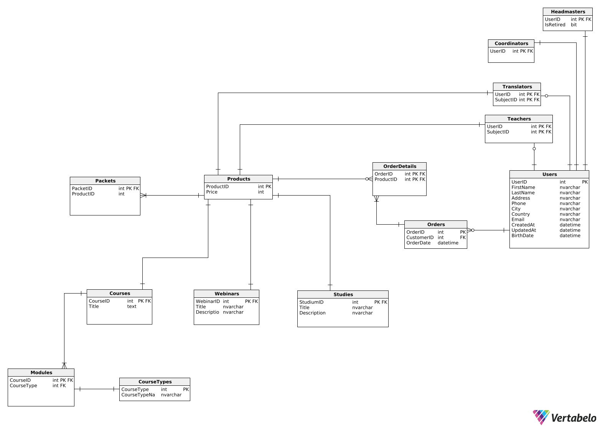
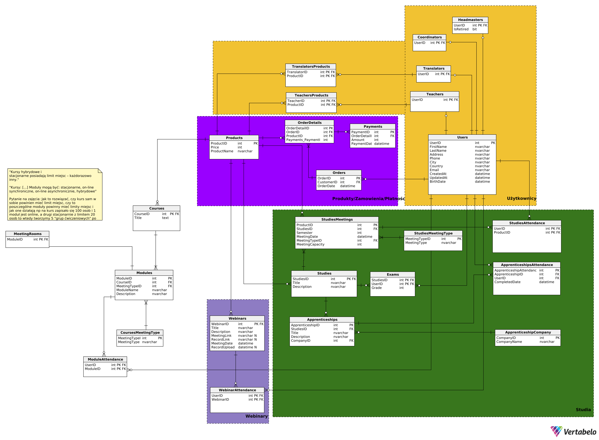

---

# Projekt - Bazy danych
Dzień i godzina zajęć: środa 18:30
*Grupa 2* 
Autorzy: *Radosław Szepielak, Paweł Saltarius, Paweł Gadomski*

---

# Wymagania i funkcje systemu
**Aktorzy:** klient, pracownik biura, zewnętrzny system płatności, nauczyciel, tłumacz, dyrektor

System będzie się składał z kilku sekcji: użytkownika, pracownika biura, nauczyciela, tłumacza i dyrektora.

## Sekcja użytkownika

W sekcji użytkownika będą znajdowały się wszystkie dostępne dla klientów funkcje oraz informacje. Aby wejść do panelu użytkownika należy się zalogować/zarejestrować na konto użytkownika. Użytkownik będzie miał dostęp do trzech usług:

### 1. Webinary
- Zapisy na nadchodzące webinary (przy płatnych webinarach płatność zewnętrznym systemem). Informacje o poszczególnych webinarach to: data, czas trwania, tytuł, opis, język, koszt, grafika, platforma spotkania oraz przycisk do zapisów.
- Nagrania z ostatnich webinarów (webinary na które byliśmy zapisani + dodatkowa zakładka na darmowe webinary na które nie byliśmy zapisani). Wyświetlana jest też data kiedy stracimy do nich dostęp.
- Nadchodzące webinary na które jesteśmy zapisani (data, informacje, link do spotkania).

### 2. Kursy
- Zapisy na dostępne kursy w następujących formach: 
    - Stacjonarne, odbywają się w wyznaczonej sali i są zaliczane na podstawie obecności, mają ustalony limit miejsc.
    - on-line synchroniczne, wymagają uczestnictwa w wydarzeniach na żywo na platformie do webinarów, nagrania są przechowywane w zewnętrznym systemie, a linki do nich udostępniane uczestnikowi, brak limitu miejsc
    - on-line asynchroniczne, zaliczenie odbywa się po obejrzeniu materiałów (automatyczna weryfikacja), na podstawie obecności, nagrania są przechowywane w zewnętrznym systemie, a linki do nich udostępniane uczestnikowi, brak limitu miejsc
    - hybrydowe, łączą podejście on-line i stacjonarne, mają ustalony limit miejsc
- Wszystkie kursy są płatne (płatność przez zewnętrzny system, wpłata zaliczki przy zapisie, opłacenie całej kwoty najpóźniej 3 dni przed rozpoczęciem kursu)
- Warunkiem zaliczenia kursu jest uczestnictwo w co najmniej 80% modułów. System automatycznie weryfikuje obecność uczestnika na modułach oraz postęp w przypadku materiałów asynchronicznych
- Po zakończeniu kursu i spełnieniu wymagań (obecność, zaliczenie modułów) uczestnik otrzymuje dyplom ukończenia, który jest automatycznie generowany	 i wysyłany Pocztą Polską na adres korespondencyjny podany w zgłoszeniu

### 3. Studia
- Klient może przeglądać sylabus danego studium.
- Możliwość zapisania się i uiszczenia wpisowego na wybrane studium o ile są dostępne miejsca.
- Uiszczenie wpłaty za dany zjazd najpóźniej 3 dni przed jego rozpoczęciem.
- Klient może podglądać harmonogram spotkań w danym semestrze, w tym daty zjazdów i formę prowadzenia zajęć.
- Klient może zapisać się na pojedyncze spotkania studyjne bez konieczności brania udziału w całych studiach (cena różni się od tej dla stałych uczestników studium)
- Klient może zapisać się na praktyki (o ile aktualnie się odbywają) oraz sprawdzać postęp aktualnie odbywających się praktyk.
- Klient może sprawdzić formę w jakiej odbywają się konkretne zajęcia (hybrydowo, on-line, stacjonarnie)
- Klient może sprawdzać swoje nieobecności
- Po zakończeniu studium i spełnieniu wymagań (obecność, praktyki) uczestnik otrzymuje dyplom ukończenia, który jest automatycznie generowany i wysyłany Pocztą Polską na adres korespondencyjny podany w zgłoszeniu
- Klient może zapytać nauczyciela uczącego dany przedmiot z którego ma nieobecność o wyznaczenie przedmiotu o zbliżonej tematyce, którym może nadrobić tą nieobeność

Użytkownik może dodawać wybrane produkty do koszyka, a system generuje link płatności w zewnętrznym systemie płatności

## Panel pracownika biura

Do panelu pracownika biura można się zalogować tylko przy użyciu konta pracownika (jest to inne konto niż te dla użytkowników). Konto pracownika można tylko utworzyć bezpośrednio przez serwer. W panelu pracownika można zarządzać usługami oferowanymi przez firmę:

### 1. Webinary
- Wyświetlać listę wszystkich webinarów. Do pomocy w szukaniu będą filtry, wyszukiwarka oraz sortowanie. Przy każdym webinarze będą się pojawiać podstawowe informacje (tytuł, data oraz status).
- Zarządzanie poszczególnymi webinarami. Po kliknięciu na webinar z listy pojawią się szczegółowe informacje oraz opcje edycji. Do szczegółowych informacji które widzi zwykły użytkownik dochodzą także informacje na temat osób zapisanych oraz płatności. Pracownik może edytować każdą informację w webinarze (poza statystykami), zmienić jego status oraz załączyć link do spotkania i nagrania.
- Ustawić datę wygaśnięcia nagrania i archiwizacji. Może też to zrobić ręcznie.

### 2. Kursy
- Wyświetlać w systemie listę wszystkich dostępnych kursów, podając podstawowe informacje takie jak tytuł kursu, datę rozpoczęcia i zakończenia, rodzaj kursu (forma prowadzenia), a także liczbę wolnych miejsc
- Filtrować kursy po tytule, terminie, formie prowadzenia czy prowadzącym, a także sortować według daty rozpoczęcia, popularności czy ceny
- Po kliknięciu na dany kurs, wyświetlają się szczegółowe informacje takie jak cena, harmonogram zajęć, opis kursu z uwzględnieniem zakresu tematycznego i wymagań, prowadzący zajęcia
- Pracownik może dodawać nowe moduły (stacjonarne, online, synchroniczne, 	
asynchroniczne, hybrydowe), również modyfikować już istniejące
- Przeglądać listę zapisanych osób wraz z informacją o ich statusie płatności,
Frekwencji na poszczególnych modułach
- Załączać link do spotkania i nagrania, ustawiać datę wygaśnięcia nagrania/   dostępu do nagrania i innych materiałów w  trakcie trwania kursu jak i po jego zakończeniu
- Generować statystyki popularności, frekwencji dla wybranego kursu

### 3. Studia
- Wyświetlać listę wszystkich studiów, w tym kluczowe informacje na ich temat typu: limit miejsc na studium
- Wyświetlać listę zjazdów dla danego studium, w tym ilość miejsc na zjazd
- Możliwość modyfikacji harmonogramu dla danego semestru.
- Dodawać nowe studia wprowadzając ich nazwę, tematykę, limit miejsc, listę zjazdów, ilość miejsc na zjazd, formę prowadzenia zajęć dla poszczególnych zajęć, cenę.
- Można wprowadzić nowo dostępne praktyki w danym semestrze.
- Można modyfikować ceny dla poszczególnych studiów oraz pojedynczych spotkań dla osób z zewnątrz
- Sprawdzenia uczestników danego studium i poszczególnych spotkań oraz statusu dokonania przez nich wpłaty na studium/zjazd

Pracownik może rownież wprowadzić dla danego webinaru/kursu studium wykładowcę w ustalonym języku oraz ewentualnego tłumacza.

Pracownik może także przypisać salę do poszczególnych zajęć 

## Panel nauczyciela
- Nauczyciel może podglądać zajęcia na których uczy.
- Może przypisać klientowi zajęcia które tamten musi odbyć aby odrobić obecność z zajęc prowadzonych przez nauczyciela
- Nauczyciel ma podgląd do listy klientów i ich frekwencji na zajęciach, na których uczy, jak również może modyfikować frekwencję

## Panel dyrektora
- Dyrektor ma wgląd do finansów i statystyk całej szkółki. 
- Tak samo jak konto pracownika - konto dyrektora trzeba założyć z poziomu serwera.
- Dodatkowo jest opcja eksportu danych do tabelki w Excelu i PDFa.
- Może dodawać/usuwać osoby z listy osób z przywilejem odroczonej zapłaty na webinar/kurs/studium.

## Panel tłumacza
- Tłumacz ma podgląd do harmonogramu zajęć, które będzie tłumaczył.

# Diagram (wersja 1)

# Diagram (wersja 2)

- dopisac date rozpoczecia studiow (aby spelnic wymog wplaty 3 dni przed)
- kursy stacjonarne i hybrydowe maja limit miejsc
- tylko jeden nauczyciel ma prowadzic
- obecnosci w praktykach mozna zamienic na nieobecnosci
- nie ma nic o grupach cwiczeniowych, tyle ile ma miejsc kurs to tyle maja moduly

# Widoki
- Nadchodzące webinary
- Niezapłacone zamówienia
- Łączny przychód z każdego miesiąca
- Studenci z niezaliczonym egzaminem
- Studenci którzy mają frekwencje poniżej progu zdawalności
- Studenci z zaliczonym/niezaliczonym stażem
