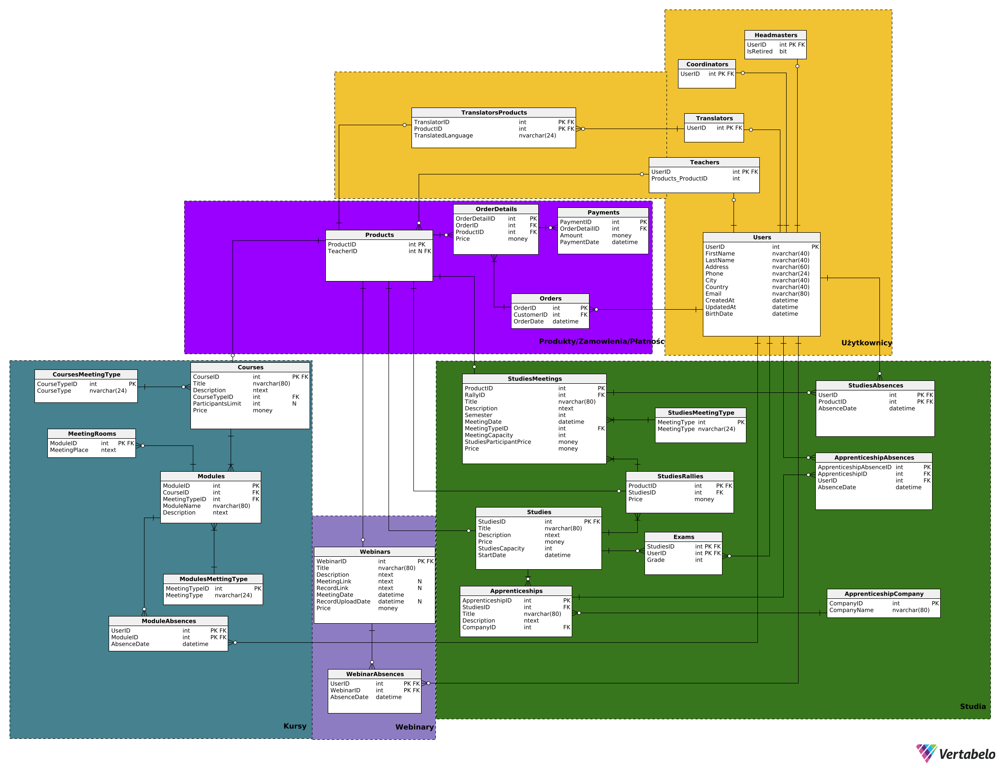

---

# Projekt - Bazy danych
Dzień i godzina zajęć: środa 18:30
*Grupa 2*<br>
Autorzy: *Radosław Szepielak, Paweł Saltarius, Paweł Gadomski*

---

# Wymagania i funkcje systemu

**Aktorzy:** klient, pracownik biura, zewnętrzny system płatności, nauczyciel, tłumacz, dyrektor

System będzie się składał z kilku sekcji: użytkownika, pracownika biura, nauczyciela, tłumacza i dyrektora.

## Sekcja użytkownika

W sekcji użytkownika będą znajdowały się wszystkie dostępne dla klientów funkcje oraz informacje. Aby wejść do panelu użytkownika należy się zalogować/zarejestrować na konto użytkownika. Użytkownik będzie miał dostęp do trzech usług:

### 1. Webinary

- Zapisy na nadchodzące webinary (przy płatnych webinarach płatność zewnętrznym systemem). Informacje o poszczególnych webinarach to: data, czas trwania, tytuł, opis, język, koszt, grafika, platforma spotkania oraz przycisk do zapisów.
- Nagrania z ostatnich webinarów (webinary na które byliśmy zapisani + dodatkowa zakładka na darmowe webinary na które nie byliśmy zapisani). Wyświetlana jest też data kiedy stracimy do nich dostęp.
- Nadchodzące webinary na które jesteśmy zapisani (data, informacje, link do spotkania).

### 2. Kursy

- Zapisy na dostępne kursy w następujących formach:
  - Stacjonarne, odbywają się w wyznaczonej sali i są zaliczane na podstawie obecności, mają ustalony limit miejsc.
  - on-line synchroniczne, wymagają uczestnictwa w wydarzeniach na żywo na platformie do webinarów, nagrania są przechowywane w zewnętrznym systemie, a linki do nich udostępniane uczestnikowi, brak limitu miejsc
  - on-line asynchroniczne, zaliczenie odbywa się po obejrzeniu materiałów (automatyczna weryfikacja), na podstawie obecności, nagrania są przechowywane w zewnętrznym systemie, a linki do nich udostępniane uczestnikowi, brak limitu miejsc
  - hybrydowe, łączą podejście on-line i stacjonarne, mają ustalony limit miejsc
- Wszystkie kursy są płatne (płatność przez zewnętrzny system, wpłata zaliczki przy zapisie, opłacenie całej kwoty najpóźniej 3 dni przed rozpoczęciem kursu)
- Warunkiem zaliczenia kursu jest uczestnictwo w co najmniej 80% modułów. System automatycznie weryfikuje obecność uczestnika na modułach oraz postęp w przypadku materiałów asynchronicznych
- Po zakończeniu kursu i spełnieniu wymagań (obecność, zaliczenie modułów) uczestnik otrzymuje dyplom ukończenia, który jest automatycznie generowany i wysyłany Pocztą Polską na adres korespondencyjny podany w zgłoszeniu

### 3. Studia

- Klient może przeglądać sylabus danego studium.
- Możliwość zapisania się i uiszczenia wpisowego na wybrane studium o ile są dostępne miejsca.
- Uiszczenie wpłaty za dany zjazd najpóźniej 3 dni przed jego rozpoczęciem.
- Klient może podglądać harmonogram spotkań w danym semestrze, w tym daty zjazdów i formę prowadzenia zajęć.
- Klient może zapisać się na pojedyncze spotkania studyjne bez konieczności brania udziału w całych studiach (cena różni się od tej dla stałych uczestników studium)
- Klient może zapisać się na praktyki (o ile aktualnie się odbywają) oraz sprawdzać postęp aktualnie odbywających się praktyk.
- Klient może sprawdzić formę w jakiej odbywają się konkretne zajęcia (hybrydowo, on-line, stacjonarnie)
- Klient może sprawdzać swoje nieobecności
- Po zakończeniu studium i spełnieniu wymagań (obecność, praktyki) uczestnik otrzymuje dyplom ukończenia, który jest automatycznie generowany i wysyłany Pocztą Polską na adres korespondencyjny podany w zgłoszeniu
- Klient może zapytać nauczyciela uczącego dany przedmiot z którego ma nieobecność o wyznaczenie przedmiotu o zbliżonej tematyce, którym może nadrobić tą nieobeność

Użytkownik może dodawać wybrane produkty do koszyka, a system generuje link płatności w zewnętrznym systemie płatności

## Panel pracownika biura

Do panelu pracownika biura można się zalogować tylko przy użyciu konta pracownika (jest to inne konto niż te dla użytkowników). Konto pracownika można tylko utworzyć bezpośrednio przez serwer. W panelu pracownika można zarządzać usługami oferowanymi przez firmę:

### 1. Webinary

- Wyświetlać listę wszystkich webinarów. Do pomocy w szukaniu będą filtry, wyszukiwarka oraz sortowanie. Przy każdym webinarze będą się pojawiać podstawowe informacje (tytuł, data oraz status).
- Zarządzanie poszczególnymi webinarami. Po kliknięciu na webinar z listy pojawią się szczegółowe informacje oraz opcje edycji. Do szczegółowych informacji które widzi zwykły użytkownik dochodzą także informacje na temat osób zapisanych oraz płatności. Pracownik może edytować każdą informację w webinarze (poza statystykami), zmienić jego status oraz załączyć link do spotkania i nagrania.
- Ustawić datę wygaśnięcia nagrania i archiwizacji. Może też to zrobić ręcznie.

### 2. Kursy

- Wyświetlać w systemie listę wszystkich dostępnych kursów, podając podstawowe informacje takie jak tytuł kursu, datę rozpoczęcia i zakończenia, rodzaj kursu (forma prowadzenia), a także liczbę wolnych miejsc
- Filtrować kursy po tytule, terminie, formie prowadzenia czy prowadzącym, a także sortować według daty rozpoczęcia, popularności czy ceny
- Po kliknięciu na dany kurs, wyświetlają się szczegółowe informacje takie jak cena, harmonogram zajęć, opis kursu z uwzględnieniem zakresu tematycznego i wymagań, prowadzący zajęcia
- Pracownik może dodawać nowe moduły (stacjonarne, online, synchroniczne,
  asynchroniczne, hybrydowe), również modyfikować już istniejące
- Przeglądać listę zapisanych osób wraz z informacją o ich statusie płatności,
  Frekwencji na poszczególnych modułach
- Załączać link do spotkania i nagrania, ustawiać datę wygaśnięcia nagrania/ dostępu do nagrania i innych materiałów w trakcie trwania kursu jak i po jego zakończeniu
- Generować statystyki popularności, frekwencji dla wybranego kursu

### 3. Studia

- Wyświetlać listę wszystkich studiów, w tym kluczowe informacje na ich temat typu: limit miejsc na studium
- Wyświetlać listę zjazdów dla danego studium, w tym ilość miejsc na zjazd
- Możliwość modyfikacji harmonogramu dla danego semestru.
- Dodawać nowe studia wprowadzając ich nazwę, tematykę, limit miejsc, listę zjazdów, ilość miejsc na zjazd, formę prowadzenia zajęć dla poszczególnych zajęć, cenę.
- Można wprowadzić nowo dostępne praktyki w danym semestrze.
- Można modyfikować ceny dla poszczególnych studiów oraz pojedynczych spotkań dla osób z zewnątrz
- Sprawdzenia uczestników danego studium i poszczególnych spotkań oraz statusu dokonania przez nich wpłaty na studium/zjazd

Pracownik może rownież wprowadzić dla danego webinaru/kursu studium wykładowcę w ustalonym języku oraz ewentualnego tłumacza.

Pracownik może także przypisać salę do poszczególnych zajęć

## Panel nauczyciela

- Nauczyciel może podglądać zajęcia na których uczy.
- Może przypisać klientowi zajęcia które tamten musi odbyć aby odrobić obecność z zajęc prowadzonych przez nauczyciela
- Nauczyciel ma podgląd do listy klientów i ich frekwencji na zajęciach, na których uczy, jak również może modyfikować frekwencję

## Panel dyrektora

- Dyrektor ma wgląd do finansów i statystyk całej szkółki.
- Tak samo jak konto pracownika - konto dyrektora trzeba założyć z poziomu serwera.
- Dodatkowo jest opcja eksportu danych do tabelki w Excelu i PDFa.
- Może dodawać/usuwać osoby z listy osób z przywilejem odroczonej zapłaty na webinar/kurs/studium.

## Panel tłumacza

- Tłumacz ma podgląd do harmonogramu zajęć, które będzie tłumaczył.

# Diagram



# Checki

### Courses:

Price_is_not_greater_than_0

```sql
Price > 0
```

ParticipantsLimit_is_either_null_or \_greater_than_0

```sql
ParticipantsLimit IS NULL OR ParticipantsLimit > 0
```

### Studies:

Capacity_is_not_greater_than_0

```sql
StudiesCapacity > 0
```

Price_is_not_greater_than_0

```sql
Price > 0
```

### Webinars:

Price_is_not_greater_than_0

```sql
Price > 0
```

### Users:

BirthDate_is_not_from_the_future

```sql
BirthDate <= GETDATE()
```

### OrderDetails:

Price_is_not_greater_than_0

```sql
Price > 0
```

### StudiesMeetings:

Price_is_not_greater_than_0

```sql
OutsiderPrice > 0
```

MeetingCapacity_is_not_greater_than_0

```sql
MeetingCapacity > 0
```

### Exams:

Grade_has_to_be_between_0_and_100

```sql
Grade > 0 AND Grade <= 100
```

### Payments:

Amount_is_not_greater_than_0

```sql
Amount > 0
```

# Widoki

Widoki jeszcze nie były testowane w bazie, ze względu na brak wygenerowanych testowych danych.

#### Studenci którzy mają frekwencje poniżej progu zdawalności (spośród spotkań które się odbyły - tylko te spotkania na które jest zapisany) RS

```sql
-- CREATE VIEW [Students under attendance threshold]
-- SELECT FirstName, LastName, TotalAbsence
-- FROM (SELECT SAb.UserID, FirstName, LastName,
--  COUNT(SAb.UserID) as TotalAbsence
--         FROM StudiesAbsences as SAb
--         JOIN Users u on u.UserID = SAb.UserID
--         GROUP BY SAb.UserID, FirstName, LastName)
-- WHERE TotalAbsence /
--     (SELECT COUNT(StudiesID) as AllMeetings
--     FROM StudiesMeetings as SM
--     WHERE MeetingDate < GETDATE()
--     GROUP BY StudiesID) < 0.8 ---??? GROUP BY StudiesID?


CREATE VIEW [Students under attendance threshold]
SELECT Attendances.FirstName, Attendances.LastName, TotalAbsence, FullAttendance
FROM (SELECT SAb.UserID, FirstName, LastName,
        COUNT(SAb.UserID) AS TotalAbsence
    FROM StudiesAbsences AS SAb
    JOIN Users u ON u.UserID = SAb.UserID
    GROUP BY SAb.UserID, FirstName, LastName) AS Absences

    JOIN

    (SELECT u.UserID, u.FirstName, u.LastName,
     COUNT(u.UserID) AS FullAttendance
    FROM Users u JOIN Orders o ON u.UserID = o.CustomerID JOIN OrderDetails od ON o.OrderID = od.OrderID JOIN StudiesMeetings sm ON od.ProductID =  sm.ProductID
    WHERE sm.MeetingDate < GETDATE()
    GROUP BY u.UserID, u.FirstName, u.LastName) AS
    Attendances
    ON Attendances.UserID = Absences.UserID
WHERE TotalAbsence / FullAttendance >= 0.2
```

#### Łączny przychód z każdego miesiąca każdego roku -- WIP (tu mozna group by cube czy tam rollup) RS

```sql
CREATE VIEW [Total income by month of each year]

WITH YearMonthDates AS (
    SELECT DISTINCT YEAR(p.PaymentDate) as Rok, m.Miesiąc
    FROM Payments p CROSS JOIN
         (SELECT TOP 12 ROW_NUMBERS() OVER (ORDER BY (SELECT NULL)) AS Miesiąc
          FROM master..spt_values) m
)
SELECT ymd.Rok Rok, ymd.Miesiąc Miesiąc, ISNULL(SUM(Amount), 0) Przychód
FROM YearMonthDates ymd LEFT JOIN Payments p
    ON ymd.Rok = YEAR(p.PaymentDate) AND ymd.Miesiąc = MONTH(p.PaymentDate)
GROUP BY ROLLUP(ymd.Rok, ymd.Miesiąc)
ORDER BY Rok DESC, Miesiąc ASC

-- SELECT YEAR(PaymentDate) Rok, MONTH(PaymentDate) Miesiąc,
--         SUM(Amount) Przychód
-- FROM Payments p
-- GROUP BY ROLLUP(YEAR(PaymentDate), MONTH(PaymentDate))
-- ORDER BY Rok DESC, Miesiąc ASC
```

#### Zestawienie przychodów dla każdego webinaru/kursu/studium - RS

```sql

SELECT TotalIncomeRaport.WebCourStudID AS wcsID, TotalIncomeRaport.Title AS Title,
         TotalIncomeRaport.Type AS Type, SUM(TotalIncomeRaport.Price) AS TotalPrice
FROM (
    SELECT s.StudiesID AS WebCourStudID, s.Title as Title, 'Studium' AS Type, SUM(od.Price) AS Price
    FROM OrderDetails od JOIN Studies s ON od.ProductID = s.StudiesID
    GROUP BY s.StudiesID, s.Title

    UNION ALL

    SELECT sr.StudiesID AS WebCourStudID, s.Title as Title, 'Studium' AS Type, SUM(od.Price) AS Price
    FROM OrderDetails od JOIN StudiesRallies sr ON od.ProductID = sr.ProductID JOIN Studies s ON sr.StudiesID = s.StudiesID
    GROUP BY sr.StudiesID, s.Title

    UNION ALL

    SELECT s.StudiesID AS WebCourStudID, s.Title as Title, 'Studium' AS Type,  SUM(od.Price) AS Price
    FROM OrderDetails od JOIN StudiesMeetings sm ON od.ProductID = sm.ProductID JOIN StudiesRallies sr ON sm.RallyID = sr.ProductID JOIN
    Studies s ON sr.StudiesID = s.StudiesID
    GROUP BY s.StudiesID, s.Title

    UNION ALL

    SELECT c.CourseID AS WebCourStudID, c.Title as Title, 'Course' AS Type, SUM(od.Price) AS Price
    FROM OrderDetails od JOIN Courses c ON od.ProductID = c.CourseID
    GROUP BY c.CourseID, c.Title

    UNION ALL

    SELECT w.WebinarID AS WebCourStudID, w.Title as Title, 'Webinar' AS Type,  SUM(od.Price) AS Price
    FROM OrderDetails od JOIN Webinars w ON od.ProductID = w.WebinarID
    GROUP BY w.WebinarID, w.Title

    ) AS TotalIncomeRaport

GROUP BY TotalIncomeRaport.WebCourStudID, TotalIncomeRaport.Title, TotalIncomeRaport.Type


```

#### Lista osób które mają niezapłacone zamówienia

#### (nic nie wpłaciły lub coś wpłaciły ale nie całość) - Paweł G

```sql
CREATE VIEW UnpaidOrders AS
SELECT u.UserID,
       u.FirstName,
       u.LastName,
       u.Email,
       o.OrderID,
       o.OrderDate,
       ISNULL(SUM(p.Amount), 0)                   AS TotalPaid,
       SUM(OD.Price)                              AS TotalOrderValue,
       (SUM(OD.Price) - ISNULL(SUM(p.Amount), 0)) AS RemainingAmount
FROM Orders o
         JOIN OrderDetails OD ON o.OrderID = OD.OrderID
         JOIN
     Users u ON o.CustomerID = u.UserID
         LEFT JOIN
     Payments p ON OD.OrderDetailID = p.OrderDetailID
GROUP BY u.UserID, u.FirstName, u.LastName, u.Email, o.OrderID, o.OrderDate
HAVING (SUM(OD.Price) - ISNULL(SUM(p.Amount), 0)) > 0;
```

#### Ogólny raport dotyczący liczby zapisanych osób na przyszłe wydarzenia (z informacją, czy wydarzenie jest stacjonarnie, czy zdalnie). - Paweł G

```sql
CREATE VIEW FutureMeetings AS
SELECT
    sm.ProductID,
    sm.MeetingDate,
    sm.Title,
    smt.MeetingType,
    COUNT(DISTINCT o.CustomerID) AS RegisteredUsers
FROM
    StudiesMeetings sm
        JOIN
    StudiesMeetingType smt ON sm.MeetingTypeID = smt.MeetingTypeID
        JOIN
    Products p ON sm.ProductID = p.ProductID
        JOIN
    OrderDetails od ON p.ProductID = od.ProductID
        JOIN
    Orders o ON od.OrderID = o.OrderID
WHERE
    sm.MeetingDate > GETDATE()
GROUP BY
    sm.ProductID, sm.MeetingDate, sm.Title, smt.MeetingType;

```

#### Ogólny raport dotyczący frekwencji na zakończonych już wydarzeniach (po jednym widoku dla StudiesMeetings/Webinars/Modules). - Paweł G

```sql
--- StudiesMeetings
CREATE VIEW PastMeetingsAttendance AS
SELECT sm.ProductID,
       sm.MeetingDate,
       sm.Title,
       (SELECT COUNT(*)
        FROM StudiesAbsences sa
        WHERE sa.ProductID = sm.ProductID) AS AbsentUsers,
       (SELECT COUNT(*)
        FROM Orders o
                 JOIN OrderDetails OD ON o.OrderID = OD.OrderID AND sm.ProductID = OD.ProductID
                 LEFT JOIN StudiesAbsences sa ON sa.UserID = o.CustomerID
        WHERE sa.UserID IS NULL)           AS PresentUsers,
       (SELECT COUNT(*)
        FROM Orders
                 JOIN OrderDetails OD ON Orders.OrderID = OD.OrderID
        WHERE sm.ProductID = OD.ProductID) AS TotalUsers
FROM StudiesMeetings sm
WHERE sm.MeetingDate < GETDATE()
GROUP BY sm.ProductID, sm.MeetingDate, sm.Title;

--- Webinars
CREATE VIEW PastWebinarsAttendance AS
SELECT w.WebinarID,
       w.MeetingDate,
       w.Title,
       (SELECT COUNT(*)
        FROM WebinarAbsences wa
        WHERE w.WebinarID = wa.WebinarID) AS AbsentUsers,
       (SELECT COUNT(*)
        FROM Orders o
                 JOIN OrderDetails OD ON o.OrderID = OD.OrderID AND w.WebinarID = OD.ProductID
                 LEFT JOIN WebinarAbsences wa ON wa.UserID = o.CustomerID
        WHERE wa.UserID IS NULL)                                         AS PresentUsers,
       (SELECT COUNT(*)
        FROM Orders
                 JOIN OrderDetails OD ON Orders.OrderID = OD.OrderID
        WHERE w.WebinarID = OD.ProductID)                                AS TotalUsers
FROM Webinars w
WHERE w.MeetingDate < GETDATE()
GROUP BY w.WebinarID, w.MeetingDate, w.Title;

--- Modules
CREATE VIEW PastModulesAttendance AS
SELECT m.ModuleID,
       m.MeetingDate,
       (SELECT COUNT(*)
        FROM ModuleAbsences ma
        WHERE m.ModuleID = ma.ModuleID) AS AbsentUsers,
       (SELECT COUNT(*)
        FROM Orders o
                 JOIN OrderDetails OD ON o.OrderID = OD.OrderID AND m.ModuleID = OD.ProductID
                 LEFT JOIN ModuleAbsences ma ON ma.UserID = o.CustomerID
        WHERE ma.UserID IS NULL)                                         AS PresentUsers,
       (SELECT COUNT(*)
        FROM Orders
                 JOIN OrderDetails OD ON Orders.OrderID = OD.OrderID
        WHERE m.ModuleID = OD.ProductID)                                AS TotalUsers
FROM Modules m
WHERE m.MeetingDate < GETDATE()
GROUP BY m.ModuleID, m.MeetingDate;

```

#### Lista obecności dla każdego kursu z datą, imieniem, nazwiskiem i informacją czy uczestnik był obecny, czy nie.

```sql
CREATE VIEW AttendanceList AS
SELECT 
    c.Title AS CourseTitle,
    m.MeetingDate AS MeetingDate,
    u.FirstName AS FirstName,
    u.LastName AS LastName,/
    CASE 
        WHEN ma.AbsenceDate IS NULL THEN 'Present'
        ELSE 'Absent'
    END AS AttendanceStatus
FROM 
    Courses c
JOIN 
    Modules m ON c.CourseID = m.CourseID
JOIN 
    Orders o ON c.CourseID = o.ProductID
JOIN 
    Users u ON o.CustomerID = u.UserID
LEFT JOIN 
    ModuleAbsences ma ON ma.UserID = u.UserID AND ma.ModuleID = m.ModuleID;
```

#### Raport bilokacji: lista osób, które są zapisane na co najmniej dwa przyszłe szkolenia, które ze sobą kolidują czasowo.

```sql
CREATE VIEW ConflictingMeetings AS
SELECT
    u.UserID,
    sm1.MeetingDate AS MeetingDate1,
    sm2.MeetingDate AS MeetingDate2,
    sm1.Title AS Meeting1Title,
    sm2.Title AS Meeting2Title
FROM
    Users u
JOIN Orders o1 ON u.UserID = o1.CustomerID
JOIN OrderDetails od1 ON o1.OrderID = od1.OrderID
JOIN StudiesMeetings sm1 ON od1.ProductID = sm1.ProductID
JOIN Orders o2 ON u.UserID = o2.CustomerID
JOIN OrderDetails od2 ON o2.OrderID = od2.OrderID
JOIN StudiesRallies sr ON od2.ProductID = sr.StudiesID
JOIN StudiesMeetings sm2 ON sr.ProductID = sm2.ProductID
WHERE
    sm1.MeetingDate = sm2.MeetingDate
    AND sm1.ProductID < sm2.ProductID
    AND sm1.MeetingDate > GETDATE();
```

#### Raport trendów zapisów

Widok wyświetlający liczbę zapisów na webinary, kursy i studia w podziale na miesiące, w ciągu ostatnich dwóch lat.
```sql
CREATE VIEW EnrollmentStatistics AS
SELECT 
    FORMAT(o.OrderDate, 'yyyy-MM') AS Month,
    CASE 
        WHEN EXISTS (SELECT 1 FROM Courses c WHERE c.CourseID = o.ProductID) THEN 'Course'
        WHEN EXISTS (SELECT 1 FROM Webinars w WHERE w.WebinarID = o.ProductID) THEN 'Webinar'
        WHEN EXISTS (SELECT 1 FROM Studies s WHERE s.StudiesID = o.ProductID) THEN 'Studies'
        ELSE 'Unknown'
    END AS ProductType,
    COUNT(o.OrderID) AS EnrollmentCount
FROM 
    Orders o
WHERE 
    o.OrderDate >= DATEADD(YEAR, -2, GETDATE())
GROUP BY 
    FORMAT(o.OrderDate, 'yyyy-MM'),
    CASE 
        WHEN EXISTS (SELECT 1 FROM Courses c WHERE c.CourseID = o.ProductID) THEN 'Course'
        WHEN EXISTS (SELECT 1 FROM Webinars w WHERE w.WebinarID = o.ProductID) THEN 'Webinar'
        WHEN EXISTS (SELECT 1 FROM Studies s WHERE s.StudiesID = o.ProductID) THEN 'Studies'
        ELSE 'Unknown'
    END
ORDER BY 
    Month ASC, ProductType ASC;
```

# Kod DDL

```sql
-- Table: ApprenticeshipAbsences
CREATE TABLE ApprenticeshipAbsences (
    ApprenticeshipAbsenceID int  NOT NULL,
    ApprenticeshipID int  NOT NULL,
    UserID int  NOT NULL,
    AbsenceDate datetime  NOT NULL,
    CONSTRAINT ApprenticeshipAbsences_pk PRIMARY KEY  (ApprenticeshipAbsenceID)
);

-- Table: ApprenticeshipCompany
CREATE TABLE ApprenticeshipCompany (
    CompanyID int  NOT NULL,
    CompanyName nvarchar(80)  NOT NULL,
    CONSTRAINT ApprenticeshipCompany_pk PRIMARY KEY  (CompanyID)
);

-- Table: Apprenticeships
CREATE TABLE Apprenticeships (
    ApprenticeshipID int  NOT NULL,
    StudiesID int  NOT NULL,
    Title nvarchar(80)  NOT NULL,
    Description ntext  NOT NULL,
    CompanyID int  NOT NULL,
    CONSTRAINT Apprenticeships_pk PRIMARY KEY  (ApprenticeshipID)
);

-- Table: Coordinators
CREATE TABLE Coordinators (
    UserID int  NOT NULL,
    CONSTRAINT Coordinators_pk PRIMARY KEY  (UserID)
);

-- Table: Courses
CREATE TABLE Courses (
    CourseID int  NOT NULL,
    Title nvarchar(80)  NOT NULL,
    Description ntext  NOT NULL,
    CourseTypeID int  NOT NULL,
    ParticipantsLimit int  NULL,
    Price money  NOT NULL,
    CONSTRAINT Price_is_not_greater_than_0 CHECK (Price > 0),
    CONSTRAINT ParticipantsLimit_is_either_null_or_greater_than_0 CHECK (ParticipantsLimit IS NULL OR ParticipantsLimit > 0),
    CONSTRAINT Courses_pk PRIMARY KEY  (CourseID)
);

-- Table: CoursesMeetingType
CREATE TABLE CoursesMeetingType (
    CourseTypeID int  NOT NULL,
    CourseType nvarchar(24)  NOT NULL,
    CONSTRAINT CoursesMeetingType_pk PRIMARY KEY  (CourseTypeID)
);

-- Table: Exams
CREATE TABLE Exams (
    StudiesID int  NOT NULL,
    UserID int  NOT NULL,
    Grade int  NOT NULL,
    CONSTRAINT Grade_has_to_be_between_0_and_100 CHECK (Grade > 0 AND Grade <= 100),
    CONSTRAINT Exams_pk PRIMARY KEY  (StudiesID,UserID)
);

-- Table: Headmasters
CREATE TABLE Headmasters (
    UserID int  NOT NULL,
    IsRetired bit  NOT NULL,
    CONSTRAINT Headmasters_pk PRIMARY KEY  (UserID)
);

-- Table: MeetingRooms
CREATE TABLE MeetingRooms (
    ModuleID int  NOT NULL,
    MeetingPlace ntext  NOT NULL,
    CONSTRAINT MeetingRooms_pk PRIMARY KEY  (ModuleID)
);

-- Table: ModuleAbsences
CREATE TABLE ModuleAbsences (
    UserID int  NOT NULL,
    ModuleID int  NOT NULL,
    AbsenceDate datetime  NOT NULL,
    CONSTRAINT ModuleAbsences_pk PRIMARY KEY  (UserID,ModuleID)
);

-- Table: Modules
CREATE TABLE Modules (
    ModuleID int  NOT NULL,
    CourseID int  NOT NULL,
    MeetingTypeID int  NOT NULL,
    ModuleName nvarchar(80)  NOT NULL,
    Description ntext  NOT NULL,
    CONSTRAINT Modules_pk PRIMARY KEY  (ModuleID)
);

-- Table: ModulesMettingType
CREATE TABLE ModulesMettingType (
    MeetingTypeID int  NOT NULL,
    MeetingType nvarchar(24)  NOT NULL,
    CONSTRAINT ModulesMettingType_pk PRIMARY KEY  (MeetingTypeID)
);

-- Table: OrderDetails
CREATE TABLE OrderDetails (
    OrderDetailID int  NOT NULL,
    OrderID int  NOT NULL,
    ProductID int  NOT NULL,
    Price money  NOT NULL,
    CONSTRAINT Price_is_not_greater_than_0 CHECK (Price > 0),
    CONSTRAINT OrderDetails_pk PRIMARY KEY  (OrderDetailID)
);

-- Table: Orders
CREATE TABLE Orders (
    OrderID int  NOT NULL,
    CustomerID int  NOT NULL,
    OrderDate datetime  NOT NULL,
    CONSTRAINT Orders_pk PRIMARY KEY  (OrderID)
);

-- Table: Payments
CREATE TABLE Payments (
    PaymentID int  NOT NULL,
    OrderDetailID int  NOT NULL,
    Amount money  NOT NULL,
    PaymentDate datetime  NOT NULL,
    CONSTRAINT Amount_is_not_greater_than_0 CHECK (Amount > 0),
    CONSTRAINT Payments_pk PRIMARY KEY  (PaymentID)
);

-- Table: Products
CREATE TABLE Products (
    ProductID int  NOT NULL,
    TeacherID int  NULL,
    CONSTRAINT Products_pk PRIMARY KEY  (ProductID)
);

-- Table: Studies
CREATE TABLE Studies (
    StudiesID int  NOT NULL,
    Title nvarchar(80)  NOT NULL,
    Description ntext  NOT NULL,
    Price money  NOT NULL,
    StudiesCapacity int  NOT NULL,
    StartDate datetime  NOT NULL,
    CONSTRAINT Capacity_is_not_greater_than_0 CHECK (StudiesCapacity > 0 ),
    CONSTRAINT Price_is_not_greater_than_0 CHECK (Price > 0),
    CONSTRAINT Studies_pk PRIMARY KEY  (StudiesID)
);

-- Table: StudiesAbsences
CREATE TABLE StudiesAbsences (
    UserID int  NOT NULL,
    ProductID int  NOT NULL,
    AbsenceDate datetime  NOT NULL,
    CONSTRAINT StudiesAbsences_pk PRIMARY KEY  (UserID,ProductID)
);

-- Table: StudiesMeetingType
CREATE TABLE StudiesMeetingType (
    MeetingTypeID int  NOT NULL,
    MeetingType nvarchar(24)  NOT NULL,
    CONSTRAINT StudiesMeetingType_pk PRIMARY KEY  (MeetingTypeID)
);

-- Table: StudiesMeetings
CREATE TABLE StudiesMeetings (
    ProductID int  NOT NULL,
    RallyID int  NOT NULL,
    Title nvarchar(80)  NOT NULL,
    Description ntext  NOT NULL,
    Semester int  NOT NULL,
    MeetingDate datetime  NOT NULL,
    MeetingTypeID int  NOT NULL,
    MeetingCapacity int  NOT NULL,
    StudiesParticipantPrice money  NOT NULL,
    Price money  NOT NULL,
    CONSTRAINT Price_is_not_greater_than_0 CHECK (OutsiderPrice > 0),
    CONSTRAINT MeetingCapacity_is_not_greater_than_0 CHECK (MeetingCapacity > 0),
    CONSTRAINT StudiesMeetings_pk PRIMARY KEY  (ProductID)
);

-- Table: StudiesRallies
CREATE TABLE StudiesRallies (
    ProductID int  NOT NULL,
    StudiesID int  NOT NULL,
    Price money  NOT NULL,
    CONSTRAINT ProductID PRIMARY KEY  (ProductID)
);

-- Table: Teachers
CREATE TABLE Teachers (
    UserID int  NOT NULL,
    Products_ProductID int  NOT NULL,
    CONSTRAINT Teachers_pk PRIMARY KEY  (UserID)
);

-- Table: Translators
CREATE TABLE Translators (
    UserID int  NOT NULL,
    CONSTRAINT Translators_pk PRIMARY KEY  (UserID)
);

-- Table: TranslatorsProducts
CREATE TABLE TranslatorsProducts (
    TranslatorID int  NOT NULL,
    ProductID int  NOT NULL,
    TranslatedLanguage nvarchar(24)  NOT NULL,
    CONSTRAINT TranslatorsProducts_pk PRIMARY KEY  (TranslatorID,ProductID)
);

-- Table: Users
CREATE TABLE Users (
    UserID int  NOT NULL IDENTITY(1, 1),
    FirstName nvarchar(40)  NOT NULL,
    LastName nvarchar(40)  NOT NULL,
    Address nvarchar(60)  NOT NULL,
    Phone nvarchar(24)  NOT NULL,
    City nvarchar(40)  NOT NULL,
    Country nvarchar(40)  NOT NULL,
    Email nvarchar(80)  NOT NULL,
    CreatedAt datetime  NOT NULL,
    UpdatedAt datetime  NOT NULL,
    BirthDate datetime  NOT NULL,
    CONSTRAINT BirthDate_is_not_from_the_future CHECK (BirthDate <= GETDATE()),
    CONSTRAINT Users_pk PRIMARY KEY  (UserID)
);

-- Table: WebinarAbsences
CREATE TABLE WebinarAbsences (
    UserID int  NOT NULL,
    WebinarID int  NOT NULL,
    AbsenceDate datetime  NOT NULL,
    CONSTRAINT WebinarAbsences_pk PRIMARY KEY  (UserID,WebinarID)
);

-- Table: Webinars
CREATE TABLE Webinars (
    WebinarID int  NOT NULL,
    Title nvarchar(80)  NOT NULL,
    Description ntext  NOT NULL,
    MeetingLink ntext  NULL,
    RecordLink ntext  NULL,
    MeetingDate datetime  NOT NULL,
    RecordUploadDate datetime  NULL,
    Price money  NOT NULL,
    CONSTRAINT Price_is_not_greater_than_0 CHECK (Price > 0),
    CONSTRAINT Webinars_pk PRIMARY KEY  (WebinarID)
);

-- foreign keys
-- Reference: ApprenticeshipCompanyID_Apprenticeships (table: Apprenticeships)
ALTER TABLE Apprenticeships ADD CONSTRAINT ApprenticeshipCompanyID_Apprenticeships
    FOREIGN KEY (CompanyID)
    REFERENCES ApprenticeshipCompany (CompanyID);

-- Reference: ApprenticeshipsAttendance_Apprenticeships (table: ApprenticeshipAbsences)
ALTER TABLE ApprenticeshipAbsences ADD CONSTRAINT ApprenticeshipsAttendance_Apprenticeships
    FOREIGN KEY (ApprenticeshipID)
    REFERENCES Apprenticeships (ApprenticeshipID);

-- Reference: ApprenticeshipsAttendance_Users (table: ApprenticeshipAbsences)
ALTER TABLE ApprenticeshipAbsences ADD CONSTRAINT ApprenticeshipsAttendance_Users
    FOREIGN KEY (UserID)
    REFERENCES Users (UserID);

-- Reference: CoursesMeetingType_Courses (table: Courses)
ALTER TABLE Courses ADD CONSTRAINT CoursesMeetingType_Courses
    FOREIGN KEY (CourseTypeID)
    REFERENCES CoursesMeetingType (CourseTypeID);

-- Reference: Courses_Products (table: Courses)
ALTER TABLE Courses ADD CONSTRAINT Courses_Products
    FOREIGN KEY (CourseID)
    REFERENCES Products (ProductID);

-- Reference: Exams_Studies (table: Exams)
ALTER TABLE Exams ADD CONSTRAINT Exams_Studies
    FOREIGN KEY (StudiesID)
    REFERENCES Studies (StudiesID);

-- Reference: Exams_Users (table: Exams)
ALTER TABLE Exams ADD CONSTRAINT Exams_Users
    FOREIGN KEY (UserID)
    REFERENCES Users (UserID);

-- Reference: MeetingRooms_Modules (table: MeetingRooms)
ALTER TABLE MeetingRooms ADD CONSTRAINT MeetingRooms_Modules
    FOREIGN KEY (ModuleID)
    REFERENCES Modules (ModuleID);

-- Reference: ModuleAttendance_Modules (table: ModuleAbsences)
ALTER TABLE ModuleAbsences ADD CONSTRAINT ModuleAttendance_Modules
    FOREIGN KEY (ModuleID)
    REFERENCES Modules (ModuleID);

-- Reference: Modules_Courses (table: Modules)
ALTER TABLE Modules ADD CONSTRAINT Modules_Courses
    FOREIGN KEY (CourseID)
    REFERENCES Courses (CourseID);

-- Reference: Modules_CoursesMeetingType (table: Modules)
ALTER TABLE Modules ADD CONSTRAINT Modules_CoursesMeetingType
    FOREIGN KEY (MeetingTypeID)
    REFERENCES ModulesMettingType (MeetingTypeID);

-- Reference: OrderDetails_Payments (table: Payments)
ALTER TABLE Payments ADD CONSTRAINT OrderDetails_Payments
    FOREIGN KEY (OrderDetailID)
    REFERENCES OrderDetails (OrderDetailID);

-- Reference: Order_Details_Orders (table: OrderDetails)
ALTER TABLE OrderDetails ADD CONSTRAINT Order_Details_Orders
    FOREIGN KEY (OrderID)
    REFERENCES Orders (OrderID);

-- Reference: Orders_Users (table: Orders)
ALTER TABLE Orders ADD CONSTRAINT Orders_Users
    FOREIGN KEY (CustomerID)
    REFERENCES Users (UserID);

-- Reference: Products_Order_Details (table: OrderDetails)
ALTER TABLE OrderDetails ADD CONSTRAINT Products_Order_Details
    FOREIGN KEY (ProductID)
    REFERENCES Products (ProductID);

-- Reference: Products_Studies (table: Studies)
ALTER TABLE Studies ADD CONSTRAINT Products_Studies
    FOREIGN KEY (StudiesID)
    REFERENCES Products (ProductID);

-- Reference: Products_StudyProducts (table: StudiesMeetings)
ALTER TABLE StudiesMeetings ADD CONSTRAINT Products_StudyProducts
    FOREIGN KEY (ProductID)
    REFERENCES Products (ProductID);

-- Reference: StudiesRallies_Products (table: StudiesRallies)
ALTER TABLE StudiesRallies ADD CONSTRAINT StudiesRallies_Products
    FOREIGN KEY (ProductID)
    REFERENCES Products (ProductID);

-- Reference: StudiesRallies_StudiesMeetings (table: StudiesMeetings)
ALTER TABLE StudiesMeetings ADD CONSTRAINT StudiesRallies_StudiesMeetings
    FOREIGN KEY (RallyID)
    REFERENCES StudiesRallies (ProductID);

-- Reference: Studies_Apprenticeships (table: Apprenticeships)
ALTER TABLE Apprenticeships ADD CONSTRAINT Studies_Apprenticeships
    FOREIGN KEY (StudiesID)
    REFERENCES Studies (StudiesID);

-- Reference: Studies_StudiesRallies (table: StudiesRallies)
ALTER TABLE StudiesRallies ADD CONSTRAINT Studies_StudiesRallies
    FOREIGN KEY (StudiesID)
    REFERENCES Studies (StudiesID);

-- Reference: StudyAttendance_StudyMeetings (table: StudiesAbsences)
ALTER TABLE StudiesAbsences ADD CONSTRAINT StudyAttendance_StudyMeetings
    FOREIGN KEY (ProductID)
    REFERENCES StudiesMeetings (ProductID);

-- Reference: StudyAttendance_Users (table: StudiesAbsences)
ALTER TABLE StudiesAbsences ADD CONSTRAINT StudyAttendance_Users
    FOREIGN KEY (UserID)
    REFERENCES Users (UserID);

-- Reference: StudyMeetings_StudiesMeetingType (table: StudiesMeetings)
ALTER TABLE StudiesMeetings ADD CONSTRAINT StudyMeetings_StudiesMeetingType
    FOREIGN KEY (MeetingTypeID)
    REFERENCES StudiesMeetingType (MeetingTypeID);

-- Reference: Teachers_Products (table: Products)
ALTER TABLE Products ADD CONSTRAINT Teachers_Products
    FOREIGN KEY (TeacherID)
    REFERENCES Teachers (UserID);

-- Reference: TranslatorsProducts_Products (table: TranslatorsProducts)
ALTER TABLE TranslatorsProducts ADD CONSTRAINT TranslatorsProducts_Products
    FOREIGN KEY (ProductID)
    REFERENCES Products (ProductID);

-- Reference: TranslatorsProducts_Translators (table: TranslatorsProducts)
ALTER TABLE TranslatorsProducts ADD CONSTRAINT TranslatorsProducts_Translators
    FOREIGN KEY (TranslatorID)
    REFERENCES Translators (UserID);

-- Reference: Users_Coordinator (table: Coordinators)
ALTER TABLE Coordinators ADD CONSTRAINT Users_Coordinator
    FOREIGN KEY (UserID)
    REFERENCES Users (UserID);

-- Reference: Users_Headmaster (table: Headmasters)
ALTER TABLE Headmasters ADD CONSTRAINT Users_Headmaster
    FOREIGN KEY (UserID)
    REFERENCES Users (UserID);

-- Reference: Users_ModuleAttendance (table: ModuleAbsences)
ALTER TABLE ModuleAbsences ADD CONSTRAINT Users_ModuleAttendance
    FOREIGN KEY (UserID)
    REFERENCES Users (UserID);

-- Reference: Users_Teachers (table: Teachers)
ALTER TABLE Teachers ADD CONSTRAINT Users_Teachers
    FOREIGN KEY (UserID)
    REFERENCES Users (UserID);

-- Reference: Users_Translator (table: Translators)
ALTER TABLE Translators ADD CONSTRAINT Users_Translator
    FOREIGN KEY (UserID)
    REFERENCES Users (UserID);

-- Reference: WebinarAttendance_Users (table: WebinarAbsences)
ALTER TABLE WebinarAbsences ADD CONSTRAINT WebinarAttendance_Users
    FOREIGN KEY (UserID)
    REFERENCES Users (UserID);

-- Reference: WebinarAttendance_Webinars (table: WebinarAbsences)
ALTER TABLE WebinarAbsences ADD CONSTRAINT WebinarAttendance_Webinars
    FOREIGN KEY (WebinarID)
    REFERENCES Webinars (WebinarID);

-- Reference: Webinars_Products (table: Webinars)
ALTER TABLE Webinars ADD CONSTRAINT Webinars_Products
    FOREIGN KEY (WebinarID)
    REFERENCES Products (ProductID);

```
