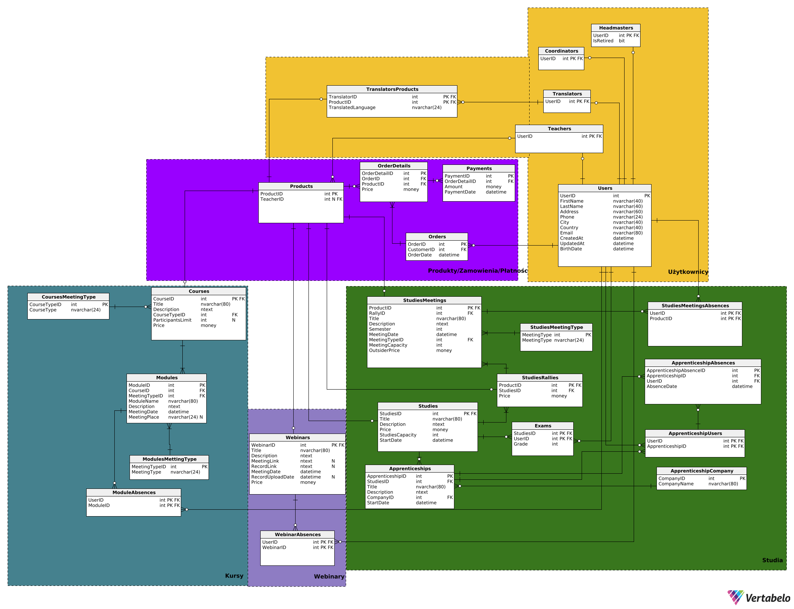

 ---

# Projekt - Bazy danych
Dzień i godzina zajęć: środa 18:30
*Grupa 2*<br>
Autorzy: *Radosław Szepielak, Paweł Saltarius, Paweł Gadomski*

---

### Kolejność sekcji
1. Wymagania i funkcje systemu
2. Diagram
3. Checki
4. Widoki
5. Triggery
6. Procedury
7. Funkcje
8. Indeksy
9. Uprawnienia
10. Kod DDL

<br/>

# Wymagania i funkcje systemu

**Aktorzy:** klient, pracownik biura, zewnętrzny system płatności, nauczyciel, tłumacz, dyrektor

System będzie się składał z kilku sekcji: użytkownika, pracownika biura, nauczyciela, tłumacza i dyrektora.

## Sekcja użytkownika

W sekcji użytkownika będą znajdowały się wszystkie dostępne dla klientów funkcje oraz informacje. Aby wejść do panelu użytkownika należy się zalogować/zarejestrować na konto użytkownika. Użytkownik będzie miał dostęp do trzech usług:

### 1. Webinary

- Zapisy na nadchodzące webinary (przy płatnych webinarach płatność zewnętrznym systemem). Informacje o poszczególnych webinarach to: data, czas trwania, tytuł, opis, język, koszt, grafika, platforma spotkania oraz przycisk do zapisów.
- Nagrania z ostatnich webinarów (webinary na które byliśmy zapisani + dodatkowa zakładka na darmowe webinary na które nie byliśmy zapisani). Wyświetlana jest też data kiedy stracimy do nich dostęp.
- Nadchodzące webinary na które jesteśmy zapisani (data, informacje, link do spotkania).

### 2. Kursy

- Zapisy na dostępne kursy w następujących formach:
  - Stacjonarne, odbywają się w wyznaczonej sali i są zaliczane na podstawie obecności, mają ustalony limit miejsc.
  - on-line synchroniczne, wymagają uczestnictwa w wydarzeniach na żywo na platformie do webinarów, nagrania są przechowywane w zewnętrznym systemie, a linki do nich udostępniane uczestnikowi, brak limitu miejsc
  - on-line asynchroniczne, zaliczenie odbywa się po obejrzeniu materiałów (automatyczna weryfikacja), na podstawie obecności, nagrania są przechowywane w zewnętrznym systemie, a linki do nich udostępniane uczestnikowi, brak limitu miejsc
  - hybrydowe, łączą podejście on-line i stacjonarne, mają ustalony limit miejsc
- Wszystkie kursy są płatne (płatność przez zewnętrzny system, wpłata zaliczki przy zapisie, opłacenie całej kwoty najpóźniej 3 dni przed rozpoczęciem kursu)
- Warunkiem zaliczenia kursu jest uczestnictwo w co najmniej 80% modułów. System automatycznie weryfikuje obecność uczestnika na modułach oraz postęp w przypadku materiałów asynchronicznych
- Po zakończeniu kursu i spełnieniu wymagań (obecność, zaliczenie modułów) uczestnik otrzymuje dyplom ukończenia, który jest automatycznie generowany i wysyłany Pocztą Polską na adres korespondencyjny podany w zgłoszeniu

### 3. Studia

- Klient może przeglądać sylabus danego studium.
- Możliwość zapisania się i uiszczenia wpisowego na wybrane studium o ile są dostępne miejsca.
- Uiszczenie wpłaty za dany zjazd najpóźniej 3 dni przed jego rozpoczęciem.
- Klient może podglądać harmonogram spotkań w danym semestrze, w tym daty zjazdów i formę prowadzenia zajęć.
- Klient może zapisać się na pojedyncze spotkania studyjne bez konieczności brania udziału w całych studiach (cena różni się od tej dla stałych uczestników studium)
- Klient może zapisać się na praktyki (o ile aktualnie się odbywają) oraz sprawdzać postęp aktualnie odbywających się praktyk.
- Klient może sprawdzić formę w jakiej odbywają się konkretne zajęcia (hybrydowo, on-line, stacjonarnie)
- Klient może sprawdzać swoje nieobecności
- Po zakończeniu studium i spełnieniu wymagań (obecność, praktyki) uczestnik otrzymuje dyplom ukończenia, który jest automatycznie generowany i wysyłany Pocztą Polską na adres korespondencyjny podany w zgłoszeniu
- Klient może zapytać nauczyciela uczącego dany przedmiot z którego ma nieobecność o wyznaczenie przedmiotu o zbliżonej tematyce, którym może nadrobić tą nieobeność

Użytkownik może dodawać wybrane produkty do koszyka, a system generuje link płatności w zewnętrznym systemie płatności

## Panel pracownika biura

Do panelu pracownika biura można się zalogować tylko przy użyciu konta pracownika (jest to inne konto niż te dla użytkowników). Konto pracownika można tylko utworzyć bezpośrednio przez serwer. W panelu pracownika można zarządzać usługami oferowanymi przez firmę:

### 1. Webinary

- Wyświetlać listę wszystkich webinarów. Do pomocy w szukaniu będą filtry, wyszukiwarka oraz sortowanie. Przy każdym webinarze będą się pojawiać podstawowe informacje (tytuł, data oraz status).
- Zarządzanie poszczególnymi webinarami. Po kliknięciu na webinar z listy pojawią się szczegółowe informacje oraz opcje edycji. Do szczegółowych informacji które widzi zwykły użytkownik dochodzą także informacje na temat osób zapisanych oraz płatności. Pracownik może edytować każdą informację w webinarze (poza statystykami), zmienić jego status oraz załączyć link do spotkania i nagrania.
- Ustawić datę wygaśnięcia nagrania i archiwizacji. Może też to zrobić ręcznie.

### 2. Kursy

- Wyświetlać w systemie listę wszystkich dostępnych kursów, podając podstawowe informacje takie jak tytuł kursu, datę rozpoczęcia i zakończenia, rodzaj kursu (forma prowadzenia), a także liczbę wolnych miejsc
- Filtrować kursy po tytule, terminie, formie prowadzenia czy prowadzącym, a także sortować według daty rozpoczęcia, popularności czy ceny
- Po kliknięciu na dany kurs, wyświetlają się szczegółowe informacje takie jak cena, harmonogram zajęć, opis kursu z uwzględnieniem zakresu tematycznego i wymagań, prowadzący zajęcia
- Pracownik może dodawać nowe moduły (stacjonarne, online, synchroniczne,
  asynchroniczne, hybrydowe), również modyfikować już istniejące
- Przeglądać listę zapisanych osób wraz z informacją o ich statusie płatności,
  Frekwencji na poszczególnych modułach
- Załączać link do spotkania i nagrania, ustawiać datę wygaśnięcia nagrania/ dostępu do nagrania i innych materiałów w trakcie trwania kursu jak i po jego zakończeniu
- Generować statystyki popularności, frekwencji dla wybranego kursu

### 3. Studia

- Wyświetlać listę wszystkich studiów, w tym kluczowe informacje na ich temat typu: limit miejsc na studium
- Wyświetlać listę zjazdów dla danego studium, w tym ilość miejsc na zjazd
- Możliwość modyfikacji harmonogramu dla danego semestru.
- Dodawać nowe studia wprowadzając ich nazwę, tematykę, limit miejsc, listę zjazdów, ilość miejsc na zjazd, formę prowadzenia zajęć dla poszczególnych zajęć, cenę.
- Można wprowadzić nowo dostępne praktyki w danym semestrze.
- Można modyfikować ceny dla poszczególnych studiów oraz pojedynczych spotkań dla osób z zewnątrz
- Sprawdzenia uczestników danego studium i poszczególnych spotkań oraz statusu dokonania przez nich wpłaty na studium/zjazd

Pracownik może rownież wprowadzić dla danego webinaru/kursu studium wykładowcę w ustalonym języku oraz ewentualnego tłumacza.

Pracownik może także przypisać salę do poszczególnych zajęć

## Panel nauczyciela

- Nauczyciel może podglądać zajęcia na których uczy.
- Może przypisać klientowi zajęcia które tamten musi odbyć aby odrobić obecność z zajęc prowadzonych przez nauczyciela
- Nauczyciel ma podgląd do listy klientów i ich frekwencji na zajęciach, na których uczy, jak również może modyfikować frekwencję

## Panel dyrektora

- Dyrektor ma wgląd do finansów i statystyk całej szkółki.
- Tak samo jak konto pracownika - konto dyrektora trzeba założyć z poziomu serwera.
- Dodatkowo jest opcja eksportu danych do tabelki w Excelu i PDFa.
- Może dodawać/usuwać osoby z listy osób z przywilejem odroczonej zapłaty na webinar/kurs/studium.

## Panel tłumacza

- Tłumacz ma podgląd do harmonogramu zajęć, które będzie tłumaczył.

# Diagram



# Checki

#### Courses:

Price_is_not_greater_than_0

```sql
Price > 0
```

ParticipantsLimit_is_either_null_or \_greater_than_0

```sql
ParticipantsLimit IS NULL OR ParticipantsLimit > 0
```

#### Studies:

Capacity_is_not_greater_than_0

```sql
StudiesCapacity > 0
```

Price_is_not_greater_than_0

```sql
Price > 0
```

#### Webinars:

Price_is_not_greater_than_0

```sql
Price > 0
```

#### Users:

BirthDate_is_not_from_the_future

```sql
BirthDate <= GETDATE()
```

#### OrderDetails:

Price_is_not_greater_than_0

```sql
Price > 0
```

#### StudiesMeetings:

Price_is_not_greater_than_0

```sql
OutsiderPrice > 0
```

MeetingCapacity_is_not_greater_than_0

```sql
MeetingCapacity > 0
```

#### Exams:

Grade_has_to_be_between_0_and_100

```sql
Grade > 0 AND Grade <= 100
```

#### Payments:

Amount_is_not_greater_than_0

```sql
Amount > 0
```

# Widoki

#### Łączny przychód z każdego miesiąca każdego roku

```sql
CREATE VIEW [IncomeMonth]
AS
WITH YearMonthDates AS (
    SELECT DISTINCT YEAR(o.OrderDate) as Rok, m.Miesiąc
    FROM Orders o
             CROSS JOIN
         (SELECT TOP 12 ROW_NUMBER() OVER (ORDER BY (SELECT NULL))
                            AS Miesiąc
          FROM master..spt_values) m)
SELECT ymd.Rok Rok, ymd.Miesiąc Miesiąc, ISNULL(SUM(Amount), 0) Przychód
FROM YearMonthDates ymd
         LEFT JOIN Payments p
                   ON ymd.Rok = YEAR(p.PaymentDate)
                       AND ymd.Miesiąc = MONTH(p.PaymentDate)
GROUP BY ROLLUP(ymd.Rok, ymd.Miesiąc)
```

#### Zestawienie przychodów dla każdego webinaru/kursu/studium

```sql
CREATE VIEW [Income]
AS
SELECT TotalIncomeRaport.WebCourStudID AS wcsID, 
    TotalIncomeRaport.Title AS Title,
    TotalIncomeRaport.Type AS Type, 
    SUM(TotalIncomeRaport.Price) AS TotalPrice
FROM (
    SELECT s.StudiesID AS WebCourStudID, s.Title as Title, 'Studium' AS Type, SUM(od.Price) AS Price
    FROM OrderDetails od JOIN Studies s ON od.ProductID = s.StudiesID
    GROUP BY s.StudiesID, s.Title

    UNION ALL

    SELECT sr.StudiesID AS WebCourStudID, 
        s.Title as Title, 
        'Studium' AS Type, 
        SUM(od.Price) AS Price
    FROM OrderDetails od 
    JOIN StudiesRallies sr 
        ON od.ProductID = sr.ProductID 
    JOIN Studies s 
        ON sr.StudiesID = s.StudiesID
    GROUP BY sr.StudiesID, s.Title

    UNION ALL

    SELECT s.StudiesID AS WebCourStudID, 
        s.Title as Title, 
        'Studium' AS Type,  
        SUM(od.Price) AS Price
    FROM OrderDetails od 
    JOIN StudiesMeetings sm 
        ON od.ProductID = sm.ProductID 
    JOIN StudiesRallies sr 
        ON sm.RallyID = sr.ProductID 
    JOIN Studies s 
        ON sr.StudiesID = s.StudiesID
    GROUP BY s.StudiesID, s.Title

    UNION ALL

    SELECT c.CourseID AS WebCourStudID, 
        c.Title as Title, 
        'Course' AS Type, 
        SUM(od.Price) AS Price
    FROM OrderDetails od 
    JOIN Courses c 
        ON od.ProductID = c.CourseID
    GROUP BY c.CourseID, c.Title

    UNION ALL

    SELECT w.WebinarID AS WebCourStudID, 
        w.Title as Title, 
        'Webinar' AS Type,  
        SUM(od.Price) AS Price
    FROM OrderDetails od 
    JOIN Webinars w 
        ON od.ProductID = w.WebinarID
    GROUP BY w.WebinarID, w.Title

    ) AS TotalIncomeRaport

GROUP BY TotalIncomeRaport.WebCourStudID, 
    TotalIncomeRaport.Title, 
    TotalIncomeRaport.Type
```

#### Lista osób które mają niezapłacone zamówienia

**(nic nie wpłaciły lub coś wpłaciły ale nie całość)** 

```sql
CREATE VIEW UnpaidOrders AS
SELECT u.UserID,
       u.FirstName,
       u.LastName,
       u.Email,
       o.OrderID,
       o.OrderDate,
       ISNULL(SUM(p.Amount), 0)                   AS TotalPaid,
       SUM(OD.Price)                              AS TotalOrderValue,
       (SUM(OD.Price) - ISNULL(SUM(p.Amount), 0)) AS RemainingAmount
FROM Orders o
         JOIN OrderDetails OD 
            ON o.OrderID = OD.OrderID
         JOIN Users u 
            ON o.CustomerID = u.UserID
         LEFT JOIN Payments p 
            ON OD.OrderDetailID = p.OrderDetailID
GROUP BY u.UserID, u.FirstName, u.LastName, u.Email, o.OrderID, o.OrderDate
HAVING (SUM(OD.Price) - ISNULL(SUM(p.Amount), 0)) > 0;
```

#### Ogólny raport dotyczący liczby zapisanych osób na przyszłe wydarzenia (z informacją, czy wydarzenie jest stacjonarnie, czy zdalnie).

```sql
CREATE VIEW FutureMeetings AS
SELECT
    sm.ProductID,
    sm.MeetingDate,
    sm.Title,
    smt.MeetingType,
    COUNT(DISTINCT o.CustomerID) + COUNT(DISTINCT odr.OrderID) AS RegisteredUsers
FROM
    StudiesMeetings sm
        JOIN
    StudiesMeetingType smt ON sm.MeetingTypeID = smt.MeetingTypeID
        JOIN
    Products p ON sm.ProductID = p.ProductID
        LEFT JOIN
    OrderDetails od ON p.ProductID = od.ProductID
        LEFT JOIN
    Orders o ON od.OrderID = o.OrderID
        LEFT JOIN
    OrderDetails odr ON odr.ProductID IN (
        SELECT sr.ProductID
        FROM StudiesRallies sr
        WHERE sr.StudiesID = sm.RallyID
    )
WHERE
    sm.MeetingDate > GETDATE()
GROUP BY
    sm.ProductID, sm.MeetingDate, sm.Title, smt.MeetingType;

```

#### Ogólny raport dotyczący frekwencji na zakończonych już wydarzeniach (po jednym widoku dla StudiesMeetings/Webinars/Modules).

```sql
--- StudiesMeetings
CREATE VIEW PastMeetingsAttendance AS
SELECT sm.ProductID,
       sm.MeetingDate,
       sm.Title,
       (SELECT COUNT(*)
        FROM StudiesAbsences sa
        WHERE sa.ProductID = sm.ProductID) AS AbsentUsers,
       (SELECT COUNT(*)
        FROM Orders o
            JOIN OrderDetails OD 
                ON o.OrderID = OD.OrderID 
                AND sm.ProductID = OD.ProductID
            LEFT JOIN StudiesAbsences sa 
                ON sa.UserID = o.CustomerID
        WHERE sa.UserID IS NULL)           AS PresentUsers,
       (SELECT COUNT(*)
        FROM Orders
            JOIN OrderDetails OD 
                ON Orders.OrderID = OD.OrderID
        WHERE sm.ProductID = OD.ProductID) AS TotalUsers
FROM StudiesMeetings sm
WHERE sm.MeetingDate < GETDATE()
GROUP BY sm.ProductID, sm.MeetingDate, sm.Title;

--- Webinars
CREATE VIEW PastWebinarsAttendance AS
SELECT w.WebinarID,
       w.MeetingDate,
       w.Title,
       (SELECT COUNT(*)
        FROM WebinarAbsences wa
        WHERE w.WebinarID = wa.WebinarID) AS AbsentUsers,
       (SELECT COUNT(*)
        FROM Orders o
            JOIN OrderDetails OD 
                ON o.OrderID = OD.OrderID 
                AND w.WebinarID = OD.ProductID
            LEFT JOIN WebinarAbsences wa 
                ON wa.UserID = o.CustomerID
        WHERE wa.UserID IS NULL)          AS PresentUsers,
       (SELECT COUNT(*)
        FROM Orders
            JOIN OrderDetails OD 
                ON Orders.OrderID = OD.OrderID
        WHERE w.WebinarID = OD.ProductID) AS TotalUsers
FROM Webinars w
WHERE w.MeetingDate < GETDATE()
GROUP BY w.WebinarID, w.MeetingDate, w.Title;

--- Modules
CREATE VIEW PastModulesAttendance AS
SELECT m.ModuleID,
       m.MeetingDate,
       (SELECT COUNT(*)
        FROM ModuleAbsences ma
        WHERE m.ModuleID = ma.ModuleID)    AS AbsentUsers,
       (SELECT COUNT(*)
        FROM Orders o
            JOIN OrderDetails OD 
                ON o.OrderID = OD.OrderID 
                AND m.ModuleID = OD.ProductID
            LEFT JOIN ModuleAbsences ma 
                ON ma.UserID = o.CustomerID
        WHERE ma.UserID IS NULL)           AS PresentUsers,
       (SELECT COUNT(*)
        FROM Orders
            JOIN OrderDetails OD 
                ON Orders.OrderID = OD.OrderID
        WHERE m.ModuleID = OD.ProductID)   AS TotalUsers
FROM Modules m
WHERE m.MeetingDate < GETDATE()
GROUP BY m.ModuleID, m.MeetingDate;
```

#### Lista obecności dla każdego kursu z datą, imieniem, nazwiskiem i informacją czy uczestnik był obecny, czy nie.

```sql
CREATE VIEW AttendanceList AS
SELECT 
    c.Title AS CourseTitle,
    m.MeetingDate AS MeetingDate,
    u.FirstName AS FirstName,
    u.LastName AS LastName,
    CASE 
        WHEN ma.UserID IS NULL THEN 'Present'
        ELSE 'Absent'
    END AS AttendanceStatus
FROM 
    Courses c
JOIN 
    Modules m ON c.CourseID = m.CourseID
JOIN 
    OrderDetails od ON c.CourseID = od.ProductID
JOIN
    Orders o ON od.OrderID = o.OrderID
JOIN 
    Users u ON o.CustomerID = u.UserID
LEFT JOIN 
    ModuleAbsences ma 
        ON ma.UserID = u.UserID 
        AND ma.ModuleID = m.ModuleID;
```

#### Raport trendów zapisów

Widok wyświetlający liczbę zapisów na webinary, kursy i studia w podziale na miesiące, w ciągu ostatnich dwóch lat.
```sql
CREATE VIEW EnrollmentStatistics AS
SELECT 
    FORMAT(o.OrderDate, 'yyyy-MM') AS Month,
    CASE 
        WHEN c.CourseID IS NOT NULL THEN 'Course'
        WHEN w.WebinarID IS NOT NULL THEN 'Webinar'
        WHEN s.StudiesID IS NOT NULL THEN 'Study'
        ELSE 'Course Meeting'
    END AS ProductType,
    COUNT(o.OrderID) AS EnrollmentCount
FROM 
    Orders o
JOIN
    OrderDetails od
    ON od.OrderID = o.OrderID
LEFT JOIN Courses c ON od.ProductID = c.CourseID
LEFT JOIN Webinars w ON od.ProductID = w.WebinarID
LEFT JOIN Studies s ON od.ProductID = s.StudiesID
WHERE 
    o.OrderDate >= DATEADD(YEAR, -2, GETDATE())
GROUP BY 
    FORMAT(o.OrderDate, 'yyyy-MM'),
    CASE 
        WHEN c.CourseID IS NOT NULL THEN 'Course'
        WHEN w.WebinarID IS NOT NULL THEN 'Webinar'
        WHEN s.StudiesID IS NOT NULL THEN 'Study'
        ELSE 'Course Meeting'
    END;
```

# Triggery
### 1. Trigger zapewniający spójność OrderDetails
``` sql
CREATE TRIGGER UnifiedTriggerOrderDetails
    ON OrderDetails
    INSTEAD OF INSERT
    AS
BEGIN
    -- Sprawdzenie pojemności studiów
    IF EXISTS (SELECT 1
               FROM INSERTED i
                        JOIN Studies s ON i.ProductID = s.StudiesID
               WHERE (SELECT COUNT(*)
                      FROM OrderDetails od
                      WHERE od.ProductID = s.StudiesID) >= s.StudiesCapacity)
        BEGIN
            THROW 50001, N'Brak dostępnych wolnych miejsc na to studium!', 1;
        END;

    -- Sprawdzenie, czy użytkownik próbuje dodać produkt związany z `StudiesRallies` bez posiadania 'Studies'
    IF EXISTS (SELECT 1
               FROM INSERTED i
                        JOIN Orders o ON i.OrderID = o.OrderID
                        JOIN StudiesRallies sr ON i.ProductID = sr.ProductID
               WHERE NOT EXISTS (SELECT 1
                                 FROM Orders o2
                                          JOIN OrderDetails od2 ON o2.OrderID = od2.OrderID
                                 WHERE o2.CustomerID = o.CustomerID
                                   AND od2.ProductID = sr.StudiesID))
        BEGIN
            THROW 50002, N'Nie możesz kupić tego StudiesRallies bez posiadania odpowiedniego Studies.', 1;
        END;

    -- Sprawdzenie, czy użytkownik próbuje kupić `StudiesMeetings`, ale już kupił odpowiadające `Studies`
    IF EXISTS (SELECT 1
               FROM INSERTED i
                        JOIN Orders o ON i.OrderID = o.OrderID
                        JOIN StudiesMeetings sm ON i.ProductID = sm.ProductID
               WHERE EXISTS (SELECT 1
                             FROM Orders o2
                                      JOIN OrderDetails od2 ON o2.OrderID = od2.OrderID
                                      JOIN Studies s ON od2.ProductID = s.StudiesID
                             WHERE o2.CustomerID = o.CustomerID
                               AND s.StudiesID = sm.ProductID))
        BEGIN
            THROW 50003, N'Nie możesz kupić tego StudiesMeeting ponieważ posiadasz już te studia.', 1;
        END;

    -- Sprawdzenie pojemności `StudiesMeetings` z uwzględnieniem `StudiesRallies`
    IF EXISTS (SELECT 1
               FROM INSERTED i
                        JOIN StudiesMeetings sm ON i.ProductID = sm.ProductID
               WHERE (SELECT COUNT(*)
                      FROM OrderDetails od
                      WHERE od.ProductID IN (SELECT sm2.ProductID
                                             FROM StudiesMeetings sm2
                                             WHERE sm2.MeetingCapacity = sm.MeetingCapacity
                                             UNION
                                             SELECT sr.ProductID
                                             FROM StudiesRallies sr
                                             WHERE sr.StudiesID = sm.ProductID)) >= sm.MeetingCapacity)
        BEGIN
            THROW 50004, N'Brak dostępnych wolnych miejsc na to spotkanie studiów!', 1;
        END;

    IF EXISTS (SELECT 1
               FROM inserted i
                        JOIN Courses c ON i.ProductID = c.CourseID
               WHERE c.ParticipantsLimit IS NOT NULL
                 AND (SELECT COUNT(*)
                      FROM OrderDetails od
                      WHERE od.ProductID = c.CourseID) >= c.ParticipantsLimit)
        BEGIN
            THROW 50005, N'Brak dostępnych miejsc na ten kurs!', 1;
        END

    IF EXISTS (SELECT 1
               FROM INSERTED i
               WHERE dbo.GetProductStartDate(i.ProductID) < GETDATE())
        BEGIN
            THROW 50006, N'Nie można kupić produktu, który już się rozpoczął.', 1;
        END;

    INSERT INTO OrderDetails (OrderID, ProductID, Price)
    SELECT OrderID, ProductID, Price
    FROM INSERTED;
END;
```
### 2. Sprawdza dodawanie nieobecności dla osoby, tylko która ma zakupiony Webinar oraz jest w pełni zapłacony.
```sql
CREATE TRIGGER CheckWebinarConditions
    ON WebinarAbsences
    INSTEAD OF INSERT
    AS
BEGIN
    SET NOCOUNT ON;

    IF EXISTS (
        SELECT 1
        FROM inserted i
        WHERE NOT EXISTS (
            SELECT 1
            FROM Orders o
                     JOIN OrderDetails od ON o.OrderID = od.OrderID
            WHERE o.CustomerID = i.UserID
              AND od.ProductID = i.WebinarID
        )
    )
        BEGIN
            THROW 50002, N'Użytkownik nie zakupił tego webinaru', 1;
        END

    IF EXISTS (
        SELECT 1
        FROM inserted i
        WHERE EXISTS (
            SELECT 1
            FROM UnpaidOrders uo
            WHERE uo.UserID = i.UserID
              AND uo.OrderID IN (
                SELECT o.OrderID
                FROM Orders o
                         JOIN OrderDetails od ON o.OrderID = od.OrderID
                WHERE od.ProductID = i.WebinarID AND o.CustomerID = i.UserID
            )
        )
    )
        BEGIN
            THROW 50001, N'Użytkownik ma niezapłacone zamówienia na ten webinar', 1;
        END

    INSERT INTO WebinarAbsences (UserID, WebinarID)
    SELECT UserID, WebinarID
    FROM inserted;
END;
```

### 3. Sprawdza czy osoba której dodajemy nieobecność do spotkania studyjnego jest powiązana z tym spotkaniem
``` sql
CREATE TRIGGER ValidateUserForAbsence
    ON StudiesMeetingsAbsences
    INSTEAD OF INSERT
    AS
BEGIN
    IF EXISTS (
        SELECT 1
        FROM INSERTED i
        WHERE NOT EXISTS (
            SELECT 1
            FROM OrderDetails od
                     JOIN Orders o ON od.OrderID = o.OrderID
            WHERE od.ProductID = i.ProductID
              AND o.CustomerID = i.UserID
            UNION
            SELECT 1
            FROM OrderDetails od
                     JOIN Orders o ON od.OrderID = o.OrderID
                     JOIN StudiesMeetings sm ON sm.ProductID = i.ProductID
                     JOIN StudiesRallies sr ON sr.ProductID = sm.RallyID
            WHERE o.CustomerID = i.UserID
        )
    )
        BEGIN
            THROW 50000, N'Użytkownik nie może być dodany, ponieważ nie ma zamówienia na odpowiedni StudiesMeeting lub Rally.', 1;
        END;

    INSERT INTO StudiesMeetingsAbsences (UserID, ProductID)
    SELECT UserID, ProductID
    FROM INSERTED;
END;
```


# Procedury
### 1. Tworzenie nowego zamówienia
W naszej implementacji zakładamy, że koszyk jest tworzony po stronie front-endu.

Cena jest znajdywana przy użyciu funkcji GetProductPrice(ProductID), której implementacja znajduje się w sekcji z funkcjami.

Zabezpieczenia przed kupnem konfliktujących produktów i przedawnionych produktów działają w taki sposób, że procedura **CreateNewOrder** tworzy nowe zamówienie po czym zaczyna dodawać wszystkie zamówione produkty do **OrderDetails**. **OrderDetails** posiada *triggery* zabezpieczające przed dodaniem konfliktujących produktów i w przypadku konfliktu zwraca błąd. Ten błąd jest przechwytywany w tej procedurze i następuje cofnięcie tranzakcji i rzucenie wyjątku.
```sql
CREATE PROCEDURE CreateNewOrder
    @CustomerID INT,
    @Products NVARCHAR(MAX) -- JSON z produktami tworzony w back-endzie
AS
BEGIN
    DECLARE @OrderID INT;

    BEGIN TRY
        BEGIN TRANSACTION;

        INSERT INTO Orders (CustomerID, OrderDate)
        VALUES (@CustomerID, GETDATE());

        SET @OrderID = SCOPE_IDENTITY();

        DECLARE @JSON NVARCHAR(MAX) = @Products;

        INSERT INTO OrderDetails (OrderID, ProductID, Price)
        SELECT 
            @OrderID,
            JSON_VALUE(value, '$.ProductID') AS ProductID,
            dbo.GetProductPrice(JSON_VALUE(value, '$.ProductID')) AS Price
        FROM OPENJSON(@JSON);

        COMMIT TRANSACTION;

        PRINT 'Zamówienie zostało utworzone pomyślnie.';
    END TRY
    BEGIN CATCH
        ROLLBACK TRANSACTION; 
        PRINT ERROR_MESSAGE();
        THROW;
    END CATCH;
END;
```
#### Przykład użycia
```sql
EXEC CreateNewOrder 
    @CustomerID = 1,
    @Products = '[{"ProductID": 1}, {"ProductID": 2}]';
```

### 2. Tworzenie studiów
```sql
CREATE PROCEDURE AddStudy
    @TeacherID INT,
    @Title NVARCHAR(80),
    @Description NTEXT,
    @Price MONEY,
    @StudiesCapacity INT,
    @StartDate DATETIME
AS
BEGIN
    BEGIN TRY
        BEGIN TRANSACTION;

        IF NOT EXISTS (SELECT 1
                    FROM Teachers
                    WHERE UserID = @TeacherID)
        BEGIN
            THROW 50001, N'Nauczyciel o podanym ID nie istnieje.', 1;
        END;

        INSERT INTO Products (TeacherID)
        VALUES (@TeacherID);

        DECLARE @NewProductID INT = SCOPE_IDENTITY();

        INSERT INTO Studies (
            StudiesID,
            Title,
            Description,
            Price,
            StudiesCapacity,
            StartDate
        )
        VALUES (
            @NewProductID,
            @Title,
            @Description,
            @Price,
            @StudiesCapacity,
            @StartDate
        );

        COMMIT TRANSACTION;
    END TRY
    BEGIN CATCH
        ROLLBACK TRANSACTION;
        THROW;
    END CATCH
END;
```

### 3. Tworzenie zjazdu studiów
```sql
CREATE PROCEDURE CreateRally
    @StudiesID INT,
    @Price MONEY
AS
BEGIN
    BEGIN TRY
        BEGIN TRANSACTION;
        INSERT INTO Products (TeacherID) VALUES (NULL);
        DECLARE @NewProductID INT;
        SET @NewProductID = SCOPE_IDENTITY();

        INSERT INTO StudiesRallies (
            ProductID,
            StudiesID,
            Price
        )
        VALUES (
            @NewProductID,
            @StudiesID,
            @Price
        );

        COMMIT TRANSACTION;
    END TRY
    BEGIN CATCH
        ROLLBACK TRANSACTION;
        THROW;
    END CATCH
END
```
### 4. Tworzenie spotkań studiów
```sql
CREATE PROCEDURE CreateStudiesMeeting
    @RallyID INT,
    @Title TEXT,
    @Description TEXT,
    @Semester INT,
    @MeetingDate datetime,
    @MeetingTypeID INT,
    @MeetingCapacity INT,
    @Price MONEY,
    @TeacherID INT
AS
BEGIN
    BEGIN TRY
        BEGIN TRANSACTION;
        INSERT INTO Products (TeacherID) VALUES (@TeacherID);
        DECLARE @NewProductID INT;
        SET @NewProductID = SCOPE_IDENTITY();

        INSERT INTO StudiesMeetings (
            ProductID,
            RallyID,
            Title,
            Description,
            Semester,
            MeetingDate,
            MeetingTypeID,
            MeetingCapacity,
            OutsiderPrice
        )
        VALUES (
            @NewProductID,
            @RallyID,
            @Title,
            @Description,
            @Semester,
            @MeetingDate,
            @MeetingTypeID,
            @MeetingCapacity,
            @Price
        );

        COMMIT TRANSACTION;
    END TRY
    BEGIN CATCH
        ROLLBACK TRANSACTION;
        THROW;
    END CATCH
END
```
### 5. Tworzenie kursów
```sql
CREATE PROCEDURE CreateCourse
    @Title NVARCHAR(80),
    @Description NTEXT,
    @CourseTypeID INT,
    @ParticipantsLimit INT = NULL,
    @TeacherID INT = NULL,
    @Price MONEY
AS
BEGIN
    BEGIN TRY
        BEGIN TRANSACTION;
        INSERT INTO Products (TeacherID) VALUES (@TeacherID);
        DECLARE @NewProductID INT;
        SET @NewProductID = SCOPE_IDENTITY();

        INSERT INTO Courses (
            CourseID,
            Title,
            Description,
            CourseTypeID,
            ParticipantsLimit,
            Price
        )
        VALUES (
            @NewProductID,
            @Title,
            @Description,
            @CourseTypeID,
            @ParticipantsLimit,
            @Price
        );

        COMMIT TRANSACTION;
    END TRY
    BEGIN CATCH
        ROLLBACK TRANSACTION;
        THROW;
    END CATCH
END
```
### 6. Tworzenie modułów kursów
```sql
CREATE PROCEDURE CreateModule
    @CourseID INT,
    @MeetingTypeID INT,
    @ModuleName NVARCHAR(80),
    @Description NTEXT,
    @MeetingDate DATETIME,
    @MeetingPlace NTEXT = NULL
AS
BEGIN
    BEGIN TRY
        BEGIN TRANSACTION;

        INSERT INTO Modules (
            CourseID,
            MeetingTypeID,
            ModuleName,
            Description,
            MeetingDate,
            MeetingPlace
        )
        VALUES (
            @CourseID,
            @MeetingTypeID,
            @ModuleName,
            @Description,
            @MeetingDate,
            @MeetingPlace
        );
        COMMIT TRANSACTION;
    END TRY
    BEGIN CATCH
        ROLLBACK TRANSACTION;
        THROW;
    END CATCH
END
```
### 7. Tworzenie webinaru
```sql
CREATE PROCEDURE CreateWebinar
    @Title NVARCHAR(80),
    @Description NTEXT,
    @MeetingLink NTEXT = NULL,
    @RecordLink NTEXT = NULL,
    @MeetingDate DATETIME,
    @RecordUploadDate DATETIME = NULL,
    @Price MONEY
AS
BEGIN
    BEGIN TRY
        BEGIN TRANSACTION;
        
        INSERT INTO Products DEFAULT VALUES;
        DECLARE @NewProductID INT;
        SET @NewProductID = SCOPE_IDENTITY();

        INSERT INTO Webinars (
            WebinarID,
            Title,
            Description,
            MeetingLink,
            RecordLink,
            MeetingDate,
            RecordUploadDate,
            Price
        )
        VALUES (
            @NewProductID,
            @Title,
            @Description,
            @MeetingLink,
            @RecordLink,
            @MeetingDate,
            @RecordUploadDate,
            @Price
        );

        COMMIT TRANSACTION;
    END TRY
    BEGIN CATCH
        ROLLBACK TRANSACTION;
        THROW;
    END CATCH
END
```

### 8. Dodawanie koordynatora
``` sql
CREATE PROCEDURE AddCoordinator
(
    @UserID INT
)
AS
BEGIN
    IF NOT EXISTS (SELECT 1
                   FROM Users
                   WHERE UserID = @UserID)
        BEGIN
            THROW 50001, N'Użytkownik o podanym ID nie istnieje.', 1;
        END;

    IF EXISTS (SELECT 1
               FROM Coordinators
               WHERE UserID = @UserID)
        BEGIN
            THROW 50002, N'Użytkownik o podanym ID już jest koordynatorem.', 1;
        END;

    INSERT INTO Coordinators (UserID)
    VALUES (@UserID);
END;
```

### 9. Dodawanie egzaminu do studium
``` sql
CREATE PROCEDURE AddExamToStudies
(
    @StudiesID INT,
    @UserID INT,
    @Grade INT
)
AS
BEGIN
    BEGIN TRY
        BEGIN TRANSACTION;

        IF NOT EXISTS (
            SELECT 1
            FROM Studies
            WHERE StudiesID = @StudiesID
        )
            BEGIN
                THROW 50001, N'Studia o podanym ID nie istnieją.', 1;
            END;

        IF NOT EXISTS (
            SELECT 1
            FROM Users
            WHERE UserID = @UserID
        )
            BEGIN
                THROW 50002, N'Użytkownik o podanym ID nie istnieje.', 1;
            END;

        IF NOT EXISTS (
            SELECT 1
            FROM Orders o
                     JOIN OrderDetails od ON o.OrderID = od.OrderID
            WHERE o.CustomerID = @UserID AND od.ProductID = @StudiesID
        )
            BEGIN
                THROW 50003, N'Użytkownik nie zakupił podanych studiów.', 1;
            END;

        IF (@Grade < 0 OR @Grade > 100)
            BEGIN
                THROW 50004, N'Ocena musi być w zakresie od 0 do 100.', 1;
            END;

        INSERT INTO Exams (StudiesID, UserID, Grade)
        VALUES (@StudiesID, @UserID, @Grade);

        COMMIT TRANSACTION;
        PRINT 'Egzamin został pomyślnie dodany.';
    END TRY
    BEGIN CATCH
        ROLLBACK TRANSACTION;
        THROW;
    END CATCH
END;
```

### 10. Dodawanie dyrektora
``` sql 
CREATE PROCEDURE AddHeadmaster
(
    @UserID INT
)
AS
BEGIN
    IF NOT EXISTS (SELECT 1
                   FROM Users
                   WHERE UserID = @UserID)
        BEGIN
            THROW 50001, N'Użytkownik o podanym ID nie istnieje.', 1;
        END;

    IF EXISTS (SELECT 1
               FROM Headmasters
               WHERE UserID = @UserID)
        BEGIN
            THROW 50002, N'Użytkownik o podanym ID już jest dyrektorem.', 1;
        END;

    INSERT INTO Headmasters (UserID, IsRetired)
    VALUES (@UserID, 0);
END;
```

### 11. Dodawanie praktyk do studiów
``` sql
CREATE PROCEDURE AddApprenticeShipToStudies
(
    @StudiesID INT,
    @Title NVARCHAR(80),
    @Description NTEXT,
    @CompanyID INT
)
AS
BEGIN
    BEGIN TRY
        BEGIN TRANSACTION;

        IF NOT EXISTS (
            SELECT 1
            FROM Studies
            WHERE StudiesID = @StudiesID
        )
            BEGIN
                THROW 50001, N'Studia o podanym ID nie istnieją.', 1;
            END;

        IF NOT EXISTS (
            SELECT 1
            FROM ApprenticeshipCompany
            WHERE CompanyID = @CompanyID
        )
            BEGIN
                THROW 50002, N'Firma o podanym ID nie istnieje.', 1;
            END;

        INSERT INTO Apprenticeships
        (
            StudiesID,
            Title,
            Description,
            CompanyID
        )
        VALUES
            (
                @StudiesID,
                @Title,
                @Description,
                @CompanyID
            );

        COMMIT TRANSACTION;
    END TRY
    BEGIN CATCH
        ROLLBACK TRANSACTION;
        THROW;
    END CATCH
END;
```

### 12. Dodawanie nauczyciela
``` sql
CREATE PROCEDURE AddTeacher
(
    @UserID INT
)
AS
BEGIN
    IF NOT EXISTS (SELECT 1
                   FROM Users
                   WHERE UserID = @UserID)
        BEGIN
            THROW 50001, N'Użytkownik o podanym ID nie istnieje.', 1;
        END;

    IF EXISTS (SELECT 1
               FROM Teachers
               WHERE UserID = @UserID)
        BEGIN
            THROW 50002, N'Użytkownik o podanym ID już jest nauczycielem.', 1;
        END;

    INSERT INTO Teachers (UserID)
    VALUES (@UserID);
END;
```

### 13. Dodawanie tłumacza
``` sql
CREATE PROCEDURE AddTranslator
(
    @UserID INT
)
AS
BEGIN
    IF NOT EXISTS (SELECT 1
                   FROM Users
                   WHERE UserID = @UserID)
        BEGIN
            THROW 50001, N'Użytkownik o podanym ID nie istnieje.', 1;
        END;

    IF EXISTS (SELECT 1
               FROM Translators
               WHERE UserID = @UserID)
        BEGIN
            THROW 50002, N'Użytkownik o podanym ID już jest tłumaczem.', 1;
        END;

    INSERT INTO Translators (UserID)
    VALUES (@UserID);
END;
```

### 14. Dodawanie tłumacza do produktu
``` sql
CREATE PROCEDURE AddTranslatorToProduct
(
    @TranslatorID INT,
    @ProductID INT,
    @TranslatedLanguage NVARCHAR(24)
)
AS
BEGIN
    IF NOT EXISTS (SELECT 1
                   FROM Translators
                   WHERE UserID = @TranslatorID)
        BEGIN
            THROW 50001, N'Tłumacz o podanym ID nie istnieje.', 1;
        END;

    IF NOT EXISTS (SELECT 1
                   FROM Products
                   WHERE ProductID = @ProductID)
        BEGIN
            THROW 50002, N'Produkt o podanym ID nie istnieje.', 1;
        END;

    IF EXISTS (SELECT 1
               FROM TranslatorsProducts
               WHERE TranslatorID = @TranslatorID
                 AND ProductID = @ProductID
                 AND TranslatedLanguage = @TranslatedLanguage)
        BEGIN
            THROW 50003, N'Ten tłumacz już jest przypisany do tego produktu dla wskazanego języka.', 1;
        END;

    INSERT INTO TranslatorsProducts (TranslatorID, ProductID, TranslatedLanguage)
    VALUES (@TranslatorID, @ProductID, @TranslatedLanguage);
END;
```

### 15. Dodawanie nieobecności użytkownika do praktyk
``` sql
CREATE PROCEDURE AddUserAbsenceToApprenticeship
(
    @UserID INT,
    @ApprenticeshipID INT,
    @AbsenceDate DATETIME
)
AS
BEGIN
    BEGIN TRY
        BEGIN TRANSACTION;

        IF NOT EXISTS (
            SELECT 1
            FROM Users
            WHERE UserID = @UserID
        )
            BEGIN
                THROW 50001, N'Użytkownik o podanym ID nie istnieje.', 1;
            END;

        IF NOT EXISTS (
            SELECT 1
            FROM Apprenticeships
            WHERE ApprenticeshipID = @ApprenticeshipID
        )
            BEGIN
                THROW 50002, N'Staż o podanym ID nie istnieje.', 1;
            END;

        IF NOT EXISTS (
            SELECT 1
            FROM ApprenticeshipUsers
            WHERE UserID = @UserID AND ApprenticeshipID = @ApprenticeshipID
        )
            BEGIN
                THROW 50003, N'Użytkownik nie jest przypisany do tego stażu.', 1;
            END;

        INSERT INTO ApprenticeshipAbsences (ApprenticeshipID, UserID, AbsenceDate)
        VALUES (@ApprenticeshipID, @UserID, @AbsenceDate);

        COMMIT TRANSACTION;
        PRINT 'Nieobecność użytkownika została pomyślnie dodana.';
    END TRY
    BEGIN CATCH
        ROLLBACK TRANSACTION;
        THROW;
    END CATCH
END;
```

### 16. Dodawanie nieobecności do webinaru
``` sql
 CREATE PROCEDURE InsertWebinarAbsence
    @UserID INT,
    @WebinarID INT
AS
BEGIN
    BEGIN TRY
        BEGIN TRANSACTION;

        INSERT INTO WebinarAbsences (UserID, WebinarID)
        VALUES (@UserID, @WebinarID);

        COMMIT TRANSACTION;
    END TRY
    BEGIN CATCH
        ROLLBACK TRANSACTION;
        THROW;
    END CATCH
END;
```

### 17. Odejście dyrektora na emeryture
``` sql 
CREATE PROCEDURE RetireHeadmaster
(
    @UserID INT
)
AS
BEGIN
    IF NOT EXISTS (SELECT 1
                   FROM Headmasters
                   WHERE UserID = @UserID)
        BEGIN
            THROW 50003, N'Użytkownik o podanym ID nie jest obecnie dyrektorem.', 1;
        END;

    UPDATE Headmasters
    SET IsRetired = 1
    WHERE UserID = @UserID;
END;
```
### 18. Dodawanie nieobecności w spotkaniach studyjnych:
``` sql
CREATE PROCEDURE InsertStudiesMeetingAbsence
    @UserID INT,
    @ProductID INT
AS
BEGIN
    BEGIN TRY
        BEGIN TRANSACTION;

        INSERT INTO StudiesMeetingsAbsences (UserID, ProductID)
        VALUES (@UserID, @ProductID);

        COMMIT TRANSACTION;

        PRINT N'Rekord został pomyślnie dodany do tabeli StudiesMeetingsAbsences.';
    END TRY
    BEGIN CATCH
        ROLLBACK TRANSACTION;
        THROW;
    END CATCH
END;
```
### 19. Wstawianie nieobecności do webinaru
```sql
CREATE PROCEDURE InsertWebinarAbsence
    @UserID INT,
    @WebinarID INT
AS
BEGIN
    BEGIN TRY
        BEGIN TRANSACTION;
        INSERT INTO WebinarAbsences (UserID, WebinarID)
        VALUES (@UserID, @WebinarID);

        COMMIT TRANSACTION;
    END TRY
    BEGIN CATCH
        ROLLBACK TRANSACTION;
        THROW;
    END CATCH
END;
```

# Funkcje
### 1. Data rozpoczęcia produktu
``` sql
CREATE FUNCTION GetProductStartDate(
    @ProductID INT
)
    RETURNS DATETIME
AS
BEGIN
    DECLARE @Date DATETIME;
    BEGIN
        SELECT @Date =
               CASE
                   WHEN EXISTS (SELECT 1 FROM Courses c WHERE c.CourseID = @ProductID) THEN
                       (SELECT TOP 1 MeetingDate
                        FROM Courses
                                 JOIN Modules ON Courses.CourseID = Modules.CourseID
                        WHERE Courses.CourseID = @ProductID
                        ORDER BY MeetingDate)
                   WHEN EXISTS (SELECT 1 FROM Studies s WHERE s.StudiesID = @ProductID) THEN
                       (SELECT StartDate
                        FROM Studies
                        WHERE StudiesID = @ProductID)
                   WHEN EXISTS (SELECT 1 FROM Webinars w WHERE w.WebinarID = @ProductID) THEN
                       (SELECT MeetingDate
                        FROM Webinars
                        WHERE WebinarID = @ProductID)
                   WHEN EXISTS (SELECT 1 FROM StudiesMeetings sm WHERE sm.ProductID = @ProductID) THEN
                       (SELECT MeetingDate
                        FROM StudiesMeetings
                        WHERE ProductID = @ProductID)
                   WHEN EXISTS (SELECT 1 FROM StudiesRallies sr WHERE sr.ProductID = @ProductID) THEN
                       (SELECT TOP 1 MeetingDate
                        FROM StudiesRallies sr
                                 JOIN StudiesMeetings sm ON sr.ProductID = sm.RallyID
                        WHERE sr.ProductID = @ProductID
                        ORDER BY MeetingDate)
                   END;
    END;

    RETURN @Date;
END
```
### 2. Cena produktu
``` sql
CREATE FUNCTION GetProductPrice
(
    @ProductID INT
)
    RETURNS MONEY
AS
BEGIN
    DECLARE @Price MONEY;
        BEGIN
            SELECT @Price =
                   CASE
                       WHEN EXISTS (SELECT 1 FROM Courses c WHERE c.CourseID = @ProductID) THEN
                           (SELECT Price FROM Courses WHERE CourseID = @ProductID)
                       WHEN EXISTS (SELECT 1 FROM Studies s WHERE s.StudiesID = @ProductID) THEN
                           (SELECT Price FROM Studies WHERE StudiesID = @ProductID)
                       WHEN EXISTS (SELECT 1 FROM Webinars w WHERE w.WebinarID = @ProductID) THEN
                           (SELECT Price FROM Webinars WHERE WebinarID = @ProductID)
                       WHEN EXISTS (SELECT 1 FROM StudiesMeetings sm WHERE sm.ProductID = @ProductID) THEN
                           (SELECT OutsiderPrice FROM StudiesMeetings WHERE ProductID = @ProductID)
                       WHEN EXISTS (SELECT 1 FROM StudiesRallies sr WHERE sr.ProductID = @ProductID) THEN
                           (SELECT Price FROM StudiesRallies WHERE ProductID = @ProductID)
                       END;
        END;

    RETURN @Price;
END
```


# Indeksy
Ten indeks przydaje się przy logowaniu, wyszukiwaniu użytkownika bez ID oraz przywracaniu hasła. Zecydowaliśmy się na stworzenie go, ze względu na o wiele częstsze logowania niż rejestracje.
```sql
CREATE INDEX USER_EMAIL_INDEX ON Users (Email);
```
Pozostałe indeksy to klucze obce w tabelach często łączonych do których dane nie są zbyt często wstawiane.
```sql
CREATE INDEX MODULES_COURSES_INDEX ON Modules (CourseID);
CREATE INDEX RALLIES_STUDIES_INDEX ON StudiesRallies (StudiesID);
CREATE INDEX MEETINGS_RALLIES_INDEX ON StudiesMeetings (RallyID);
```

# Uprawnienia
Na początek:
```sql
USE u_szepiela;
```
#### 1. Administrator
Administrator posiada wszystkie uprawnienia, gdyż potrzebuje ich do prac serwisowych, dodawania nowych funkcjonalności i naprawiania potencjalnych błędów.
```sql
CREATE ROLE ADMIN;
ALTER ROLE db_owner ADD MEMBER [ADMIN];
```

#### 2. Księgowość
Uprawnienia do operowania danymi w bazie bez możliwości modyfikacji samej struktury bazy.
```sql
CREATE ROLE Accountant;
GRANT SELECT, INSERT, UPDATE, DELETE ON SCHEMA::dbo TO Accountant;
```

# Kod DDL

```sql
CREATE TABLE ApprenticeshipAbsences (
    ApprenticeshipAbsenceID int  NOT NULL IDENTITY(1, 1),
    ApprenticeshipID int  NOT NULL,
    UserID int  NOT NULL,
    AbsenceDate datetime  NOT NULL,
    CONSTRAINT ApprenticeshipAbsences_pk PRIMARY KEY  (ApprenticeshipAbsenceID)
);

CREATE TABLE ApprenticeshipCompany (
    CompanyID int  NOT NULL IDENTITY(1, 1),
    CompanyName nvarchar(80)  NOT NULL,
    CONSTRAINT ApprenticeshipCompany_pk PRIMARY KEY  (CompanyID)
);

CREATE TABLE ApprenticeshipUsers (
    UserID int  NOT NULL,
    ApprenticeshipID int  NOT NULL,
    CONSTRAINT ApprenticeshipUsers_pk PRIMARY KEY  (ApprenticeshipID,UserID)
);

CREATE TABLE Apprenticeships (
    ApprenticeshipID int  NOT NULL IDENTITY(1, 1),
    StudiesID int  NOT NULL,
    Title nvarchar(80)  NOT NULL,
    Description ntext  NOT NULL,
    CompanyID int  NOT NULL,
    StartDate datetime  NOT NULL,
    CONSTRAINT Apprenticeships_pk PRIMARY KEY  (ApprenticeshipID)
);

CREATE TABLE Coordinators (
    UserID int  NOT NULL,
    CONSTRAINT Coordinators_pk PRIMARY KEY  (UserID)
);

CREATE TABLE Courses (
    CourseID int  NOT NULL,
    Title nvarchar(80)  NOT NULL,
    Description ntext  NOT NULL,
    CourseTypeID int  NOT NULL,
    ParticipantsLimit int  NULL,
    Price money  NOT NULL,
    CONSTRAINT Price_is_not_greater_than_0 CHECK (Price > 0),
    CONSTRAINT ParticipantsLimit_is_either_null_or_greater_than_0 CHECK (ParticipantsLimit IS NULL OR ParticipantsLimit > 0),
    CONSTRAINT Courses_pk PRIMARY KEY  (CourseID)
);

CREATE TABLE CoursesMeetingType (
    CourseTypeID int  NOT NULL IDENTITY(1, 1),
    CourseType nvarchar(24)  NOT NULL,
    CONSTRAINT CoursesMeetingType_pk PRIMARY KEY  (CourseTypeID)
);

CREATE TABLE Exams (
    StudiesID int  NOT NULL,
    UserID int  NOT NULL,
    Grade int  NOT NULL,
    CONSTRAINT Grade_has_to_be_between_0_and_100 CHECK (Grade > 0 AND Grade <= 100),
    CONSTRAINT Exams_pk PRIMARY KEY  (StudiesID,UserID)
);

CREATE TABLE Headmasters (
    UserID int  NOT NULL,
    IsRetired bit  NOT NULL,
    CONSTRAINT Headmasters_pk PRIMARY KEY  (UserID)
);

CREATE TABLE ModuleAbsences (
    UserID int  NOT NULL,
    ModuleID int  NOT NULL,
    CONSTRAINT ModuleAbsences_pk PRIMARY KEY  (UserID,ModuleID)
);

CREATE TABLE Modules (
    ModuleID int  NOT NULL IDENTITY(1, 1),
    CourseID int  NOT NULL,
    MeetingTypeID int  NOT NULL,
    ModuleName nvarchar(80)  NOT NULL,
    Description ntext  NOT NULL,
    MeetingDate datetime  NOT NULL,
    MeetingPlace nvarchar(24)  NULL,
    CONSTRAINT Modules_pk PRIMARY KEY  (ModuleID)
);

CREATE TABLE ModulesMettingType (
    MeetingTypeID int  NOT NULL IDENTITY(1, 1),
    MeetingType nvarchar(24)  NOT NULL,
    CONSTRAINT ModulesMettingType_pk PRIMARY KEY  (MeetingTypeID)
);

CREATE TABLE OrderDetails (
    OrderDetailID int  NOT NULL IDENTITY(1, 1),
    OrderID int  NOT NULL,
    ProductID int  NOT NULL,
    Price money  NOT NULL,
    CONSTRAINT Price_is_not_greater_than_0 CHECK (Price > 0),
    CONSTRAINT OrderDetails_pk PRIMARY KEY  (OrderDetailID)
);

CREATE TABLE Orders (
    OrderID int  NOT NULL IDENTITY(1, 1),
    CustomerID int  NOT NULL,
    OrderDate datetime  NOT NULL,
    CONSTRAINT Orders_pk PRIMARY KEY  (OrderID)
);

CREATE TABLE Payments (
    PaymentID int  NOT NULL IDENTITY(1, 1),
    OrderDetailID int  NOT NULL,
    Amount money  NOT NULL,
    PaymentDate datetime  NOT NULL,
    CONSTRAINT Amount_is_not_greater_than_0 CHECK (Amount > 0),
    CONSTRAINT Payments_pk PRIMARY KEY  (PaymentID)
);

CREATE TABLE Products (
    ProductID int  NOT NULL IDENTITY(1, 1),
    TeacherID int  NULL,
    CONSTRAINT Products_pk PRIMARY KEY  (ProductID)
);

CREATE TABLE Studies (
    StudiesID int  NOT NULL,
    Title nvarchar(80)  NOT NULL,
    Description ntext  NOT NULL,
    Price money  NOT NULL,
    StudiesCapacity int  NOT NULL,
    StartDate datetime  NOT NULL,
    CONSTRAINT Capacity_is_not_greater_than_0 CHECK (StudiesCapacity > 0 ),
    CONSTRAINT Price_is_not_greater_than_0 CHECK (Price > 0),
    CONSTRAINT Studies_pk PRIMARY KEY  (StudiesID)
);

CREATE TABLE StudiesMeetingType (
    MeetingTypeID int  NOT NULL IDENTITY(1, 1),
    MeetingType nvarchar(24)  NOT NULL,
    CONSTRAINT StudiesMeetingType_pk PRIMARY KEY  (MeetingTypeID)
);

CREATE TABLE StudiesMeetings (
    ProductID int  NOT NULL,
    RallyID int  NOT NULL,
    Title nvarchar(80)  NOT NULL,
    Description ntext  NOT NULL,
    Semester int  NOT NULL,
    MeetingDate datetime  NOT NULL,
    MeetingTypeID int  NOT NULL,
    MeetingCapacity int  NOT NULL,
    OutsiderPrice money  NOT NULL,
    CONSTRAINT Price_is_not_greater_than_0 CHECK (Price > 0),
    CONSTRAINT MeetingCapacity_is_not_greater_than_0 CHECK (MeetingCapacity > 0),
    CONSTRAINT StudiesMeetings_pk PRIMARY KEY  (ProductID)
);

CREATE TABLE StudiesMeetingsAbsences (
    UserID int  NOT NULL,
    ProductID int  NOT NULL,
    CONSTRAINT StudiesMeetingsAbsences_pk PRIMARY KEY  (UserID,ProductID)
);

CREATE TABLE StudiesRallies (
    ProductID int  NOT NULL,
    StudiesID int  NOT NULL,
    Price money  NOT NULL,
    CONSTRAINT ProductID PRIMARY KEY  (ProductID)
);

CREATE TABLE Teachers (
    UserID int  NOT NULL,
    CONSTRAINT Teachers_pk PRIMARY KEY  (UserID)
);

CREATE TABLE Translators (
    UserID int  NOT NULL,
    CONSTRAINT Translators_pk PRIMARY KEY  (UserID)
);

CREATE TABLE TranslatorsProducts (
    TranslatorID int  NOT NULL,
    ProductID int  NOT NULL,
    TranslatedLanguage nvarchar(24)  NOT NULL,
    CONSTRAINT TranslatorsProducts_pk PRIMARY KEY  (TranslatorID,ProductID)
);

CREATE TABLE Users (
    UserID int  NOT NULL IDENTITY(1, 1),
    FirstName nvarchar(40)  NOT NULL,
    LastName nvarchar(40)  NOT NULL,
    Address nvarchar(60)  NOT NULL,
    Phone nvarchar(24)  NOT NULL,
    City nvarchar(40)  NOT NULL,
    Country nvarchar(40)  NOT NULL,
    Email nvarchar(80)  NOT NULL,
    CreatedAt datetime  NOT NULL,
    UpdatedAt datetime  NOT NULL,
    BirthDate datetime  NOT NULL,
    CONSTRAINT BirthDate_is_not_from_the_future CHECK (BirthDate <= GETDATE()),
    CONSTRAINT Users_pk PRIMARY KEY  (UserID)
);

CREATE TABLE WebinarAbsences (
    UserID int  NOT NULL,
    WebinarID int  NOT NULL,
    CONSTRAINT WebinarAbsences_pk PRIMARY KEY  (UserID,WebinarID)
);

CREATE TABLE Webinars (
    WebinarID int  NOT NULL,
    Title nvarchar(80)  NOT NULL,
    Description ntext  NOT NULL,
    MeetingLink ntext  NULL,
    RecordLink ntext  NULL,
    MeetingDate datetime  NOT NULL,
    RecordUploadDate datetime  NULL,
    Price money  NOT NULL,
    CONSTRAINT Price_is_not_greater_than_0 CHECK (Price > 0),
    CONSTRAINT Webinars_pk PRIMARY KEY  (WebinarID)
);

-- Reference: ApprenticeshipAbsences_ApprenticeshipUsers (table: ApprenticeshipAbsences)
ALTER TABLE ApprenticeshipAbsences ADD CONSTRAINT ApprenticeshipAbsences_ApprenticeshipUsers
    FOREIGN KEY (ApprenticeshipID,UserID)
    REFERENCES ApprenticeshipUsers (ApprenticeshipID,UserID);

-- Reference: ApprenticeshipCompanyID_Apprenticeships (table: Apprenticeships)
ALTER TABLE Apprenticeships ADD CONSTRAINT ApprenticeshipCompanyID_Apprenticeships
    FOREIGN KEY (CompanyID)
    REFERENCES ApprenticeshipCompany (CompanyID);

-- Reference: ApprenticeshipUsers_Apprenticeships (table: ApprenticeshipUsers)
ALTER TABLE ApprenticeshipUsers ADD CONSTRAINT ApprenticeshipUsers_Apprenticeships
    FOREIGN KEY (ApprenticeshipID)
    REFERENCES Apprenticeships (ApprenticeshipID);

-- Reference: ApprenticeshipUsers_Users (table: ApprenticeshipUsers)
ALTER TABLE ApprenticeshipUsers ADD CONSTRAINT ApprenticeshipUsers_Users
    FOREIGN KEY (UserID)
    REFERENCES Users (UserID);

-- Reference: ApprenticeshipsAttendance_Apprenticeships (table: ApprenticeshipAbsences)
ALTER TABLE ApprenticeshipAbsences ADD CONSTRAINT ApprenticeshipsAttendance_Apprenticeships
    FOREIGN KEY (ApprenticeshipID)
    REFERENCES Apprenticeships (ApprenticeshipID);

-- Reference: CoursesMeetingType_Courses (table: Courses)
ALTER TABLE Courses ADD CONSTRAINT CoursesMeetingType_Courses
    FOREIGN KEY (CourseTypeID)
    REFERENCES CoursesMeetingType (CourseTypeID);

-- Reference: Courses_Products (table: Courses)
ALTER TABLE Courses ADD CONSTRAINT Courses_Products
    FOREIGN KEY (CourseID)
    REFERENCES Products (ProductID);

-- Reference: Exams_Studies (table: Exams)
ALTER TABLE Exams ADD CONSTRAINT Exams_Studies
    FOREIGN KEY (StudiesID)
    REFERENCES Studies (StudiesID);

-- Reference: Exams_Users (table: Exams)
ALTER TABLE Exams ADD CONSTRAINT Exams_Users
    FOREIGN KEY (UserID)
    REFERENCES Users (UserID);

-- Reference: ModuleAttendance_Modules (table: ModuleAbsences)
ALTER TABLE ModuleAbsences ADD CONSTRAINT ModuleAttendance_Modules
    FOREIGN KEY (ModuleID)
    REFERENCES Modules (ModuleID);

-- Reference: Modules_Courses (table: Modules)
ALTER TABLE Modules ADD CONSTRAINT Modules_Courses
    FOREIGN KEY (CourseID)
    REFERENCES Courses (CourseID);

-- Reference: Modules_CoursesMeetingType (table: Modules)
ALTER TABLE Modules ADD CONSTRAINT Modules_CoursesMeetingType
    FOREIGN KEY (MeetingTypeID)
    REFERENCES ModulesMettingType (MeetingTypeID);

-- Reference: OrderDetails_Payments (table: Payments)
ALTER TABLE Payments ADD CONSTRAINT OrderDetails_Payments
    FOREIGN KEY (OrderDetailID)
    REFERENCES OrderDetails (OrderDetailID);

-- Reference: Order_Details_Orders (table: OrderDetails)
ALTER TABLE OrderDetails ADD CONSTRAINT Order_Details_Orders
    FOREIGN KEY (OrderID)
    REFERENCES Orders (OrderID);

-- Reference: Orders_Users (table: Orders)
ALTER TABLE Orders ADD CONSTRAINT Orders_Users
    FOREIGN KEY (CustomerID)
    REFERENCES Users (UserID);

-- Reference: Products_Order_Details (table: OrderDetails)
ALTER TABLE OrderDetails ADD CONSTRAINT Products_Order_Details
    FOREIGN KEY (ProductID)
    REFERENCES Products (ProductID);

-- Reference: Products_Studies (table: Studies)
ALTER TABLE Studies ADD CONSTRAINT Products_Studies
    FOREIGN KEY (StudiesID)
    REFERENCES Products (ProductID);

-- Reference: Products_StudyProducts (table: StudiesMeetings)
ALTER TABLE StudiesMeetings ADD CONSTRAINT Products_StudyProducts
    FOREIGN KEY (ProductID)
    REFERENCES Products (ProductID);

-- Reference: StudiesRallies_Products (table: StudiesRallies)
ALTER TABLE StudiesRallies ADD CONSTRAINT StudiesRallies_Products
    FOREIGN KEY (ProductID)
    REFERENCES Products (ProductID);

-- Reference: StudiesRallies_StudiesMeetings (table: StudiesMeetings)
ALTER TABLE StudiesMeetings ADD CONSTRAINT StudiesRallies_StudiesMeetings
    FOREIGN KEY (RallyID)
    REFERENCES StudiesRallies (ProductID);

-- Reference: Studies_Apprenticeships (table: Apprenticeships)
ALTER TABLE Apprenticeships ADD CONSTRAINT Studies_Apprenticeships
    FOREIGN KEY (StudiesID)
    REFERENCES Studies (StudiesID);

-- Reference: Studies_StudiesRallies (table: StudiesRallies)
ALTER TABLE StudiesRallies ADD CONSTRAINT Studies_StudiesRallies
    FOREIGN KEY (StudiesID)
    REFERENCES Studies (StudiesID);

-- Reference: StudyAttendance_StudyMeetings (table: StudiesMeetingsAbsences)
ALTER TABLE StudiesMeetingsAbsences ADD CONSTRAINT StudyAttendance_StudyMeetings
    FOREIGN KEY (ProductID)
    REFERENCES StudiesMeetings (ProductID);

-- Reference: StudyAttendance_Users (table: StudiesMeetingsAbsences)
ALTER TABLE StudiesMeetingsAbsences ADD CONSTRAINT StudyAttendance_Users
    FOREIGN KEY (UserID)
    REFERENCES Users (UserID);

-- Reference: StudyMeetings_StudiesMeetingType (table: StudiesMeetings)
ALTER TABLE StudiesMeetings ADD CONSTRAINT StudyMeetings_StudiesMeetingType
    FOREIGN KEY (MeetingTypeID)
    REFERENCES StudiesMeetingType (MeetingTypeID);

-- Reference: Teachers_Products (table: Products)
ALTER TABLE Products ADD CONSTRAINT Teachers_Products
    FOREIGN KEY (TeacherID)
    REFERENCES Teachers (UserID);

-- Reference: TranslatorsProducts_Products (table: TranslatorsProducts)
ALTER TABLE TranslatorsProducts ADD CONSTRAINT TranslatorsProducts_Products
    FOREIGN KEY (ProductID)
    REFERENCES Products (ProductID);

-- Reference: TranslatorsProducts_Translators (table: TranslatorsProducts)
ALTER TABLE TranslatorsProducts ADD CONSTRAINT TranslatorsProducts_Translators
    FOREIGN KEY (TranslatorID)
    REFERENCES Translators (UserID);

-- Reference: Users_Coordinator (table: Coordinators)
ALTER TABLE Coordinators ADD CONSTRAINT Users_Coordinator
    FOREIGN KEY (UserID)
    REFERENCES Users (UserID);

-- Reference: Users_Headmaster (table: Headmasters)
ALTER TABLE Headmasters ADD CONSTRAINT Users_Headmaster
    FOREIGN KEY (UserID)
    REFERENCES Users (UserID);

-- Reference: Users_ModuleAttendance (table: ModuleAbsences)
ALTER TABLE ModuleAbsences ADD CONSTRAINT Users_ModuleAttendance
    FOREIGN KEY (UserID)
    REFERENCES Users (UserID);

-- Reference: Users_Teachers (table: Teachers)
ALTER TABLE Teachers ADD CONSTRAINT Users_Teachers
    FOREIGN KEY (UserID)
    REFERENCES Users (UserID);

-- Reference: Users_Translator (table: Translators)
ALTER TABLE Translators ADD CONSTRAINT Users_Translator
    FOREIGN KEY (UserID)
    REFERENCES Users (UserID);

-- Reference: WebinarAttendance_Users (table: WebinarAbsences)
ALTER TABLE WebinarAbsences ADD CONSTRAINT WebinarAttendance_Users
    FOREIGN KEY (UserID)
    REFERENCES Users (UserID);

-- Reference: WebinarAttendance_Webinars (table: WebinarAbsences)
ALTER TABLE WebinarAbsences ADD CONSTRAINT WebinarAttendance_Webinars
    FOREIGN KEY (WebinarID)
    REFERENCES Webinars (WebinarID);

-- Reference: Webinars_Products (table: Webinars)
ALTER TABLE Webinars ADD CONSTRAINT Webinars_Products
    FOREIGN KEY (WebinarID)
    REFERENCES Products (ProductID);
```